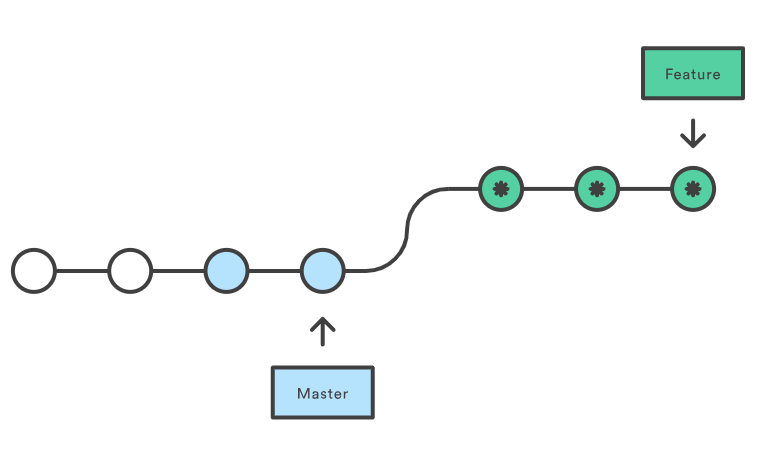

# Вопросы для собеседования на позицию администратора Linux и DevOps инженера.

---

## Linux. Basic

1. Что такое LA? В каких единицах измеряется?
<details>
  <summary>Ответ</summary>
  LA (load average) -- параметр, определяющий среднюю нагрузку на систему за период времени (1 мин, 5 минут, 15 минут). Изменяется в количестве задач на одно ядро процессора. На нагрузку системы также влияет количество задач ввода-вывода и задержка сети. Также влияние на расчета LA оказывает: 1. Технология Hyper-Threading, которая делит одно физическое ядро на 2 логических, 2. Технология Turbo Bust, которая позволяет разгонять тактовую частоту процессора и работать на частоте выше заявленной, т.е. выше номинальной частоты (время на обработку одной задачи уменьшается). 
</details>

2. Что будет если на сервере LA = 100? 
<details>
  <summary>Ответ</summary>
  Вероятно, что на сервере будет наблюдаться замедленная работа сервисов, но если параметр LA равен количеству ядер в системе или количеству потоков в системе, то данная нагрузка является нормальной.
</details>

3. Почему при высоких показателях значения LA на сервере может не наблюдаться проблем (консоль ssh отзывается, сервисы работают в обычном режиме)?
<details>
  <summary>Ответ</summary>

  На параметр нагрузки LA влияет также и ожидание ввода-вывода (параметр *wa* в утилите *top*) в дисков и задержка сети. Данные параметры могут не влиять на работу основных сервисов в системе, но учитываются при расчете общей нагрузки на систему. 

</details>

4. Представлен вывод команды *top*. Что означает каждая запись в выводе?
   ```
   top - 21:29:24 up 14:18,  1 user,  load average: 0,78, 1,48,   1,10
   Tasks: 277 total,   3 running, 274 sleeping,   0 stopped,      0 zombie
   %Cpu(s): 12,4 us,  2,5 sy,  0,1 ni, 84,8 id,  0,1 wa,  0,0   hi,  0,1 si,  0,0 st
   KiB Mem :  7106404 total,   306972 free,  3127144 used,    3672288 buff/cache
   KiB Swap:  8191996 total,  8191996 free,        0 used.    3270520 avail Mem 
   ```

<details>
  <summary>Ответ</summary>

*top* - название утилиты.

*21:29:24* - текущее время системы.

*up 14:18* - сколько часов:минут система работает с момента последнего запуска.

*1 user* - количество пользователей авторизованных в системе.

*load average: 0,78, 1,48, 1,10* - параметр средней нагрузки на систему за период времени 1 минута, 5 минут, 15 минут.

*277 total* - всего процессов в системе.

*3 running* - количество процессов в работе.

*274 sleeping* - количество процессов в состоянии sleeping: ожидает какого-либо события или сигнала.

*0 stopped* - количество приостановленных процессов сигналом STOP или выполнением трассировки.

*0 zombie* - количество зомби-процессов, которые завершили своё выполнение, но присутствующие в системе, чтобы дать родительскому процессу считать свой код завершения.

| Параметр | Описание |
|-------------------------------|------------------------------------------------------------------------------------------------|
| us (user) | Использование процессора пользовательским процессами |
| sy (system) | Использование процессора системным процессами |
| ni (nice) | Использование процессора процессами с измененным приоритетом с помощью команды nice |
| id (idle) | Простой процессора. Можно сказать, что это свободные ресурсы |
| wa (IO-wait) | Говорит о простое, связанным с вводом/выводом |
| hi (hardware interrupts) | Показывает сколько процессорного времени было потрачено на обслуживание аппаратного прерывания |
| si (software interrupts) | Показывает сколько процессорного времени было потрачено на обслуживание софтверного прерывания |
| st (stolen by the hypervisor) | Показывает сколько процессорного времени было «украдено» гипервизором |

KiB Mem - количество оперативной памяти в кибибайтах (кратно 1024):
*7106404 total* -- всего доступно оперативной памяти в системе,
*306972 free* -- свободно оперативной памяти для использования,
*3127144 used* -- использовано оперативной памяти,
*3672288 buff/cache* -- буферизовано/закешировано оперативной памяти.

*KiB Swap* - количество swap-памяти в кибибайтах (кратно 1024), которые выделено на диске:
*8191996 total* - всего выделено swap-памяти,
*8191996 free* - свободно swap-памяти
*0 used* - использовано swap-памяти,
*3270520 avail Mem* - доступно для использования swap-памяти.

</details>

5. Как в утилите top в Linux посмотреть нагрузку на каждое ядро процессора?

<details>
  <summary>Ответ</summary>

  В утилите top нажать `1`, чтобы отобразить все ядра в системе.

</details>

6. Как в утилите top в Linux посмотреть какой командой был запущен процесс?

<details>
  <summary>Ответ</summary>

  В утилите top нажать `c`, чтобы отобразить команды, которыми были запущены процессы.

</details>

6. Как происходит HTTPS соединение?

<details>
  <summary>Ответ</summary>

Когда вы вводите адрес сайта в браузере, он спрашивает у сервера, установлен ли для сайта сертификат. В ответ сервер отправляет общую информацию об SSL-сертификате и публичный ключ, то есть сам сертификат. Браузер сверяет информацию со списком авторизованных центров сертификации. Если всё в порядке, браузер генерирует сеансовый ключ, зашифровывает его публичным ключом и отправляет на сервер. Сервер расшифровывает сообщение и сохраняет сеансовый ключ. После этого между браузером и сайтом устанавливается безопасное соединение через протокол HTTPS.


</details>

7. Чем отличается TCP от UDP? Что лучше?

<details>
  <summary>Ответ</summary>

TCP – транспортный протокол передачи данных в сетях TCP/IP, предварительно устанавливающий соединение с сетью.
Ориентирован на соединение, используется для передачи данных (электронная почта, файлы, сообщения). При определении потери пакетов будет выполнен перезапрос потерянных пакетов.

UDP – транспортный протокол, передающий сообщения-датаграммы без необходимости установки соединения в IP-сети. Не ориентирован на установление соединения, используется в потоковой передаче данных (IPTV, VoIP). При потере пакетов перезапроса потерянных пакетов не происходит.

Нельзя сказать, что TCP лучше UDP, т.к. данные транспортные протоколы используются для различных типов передачи трафика.

</details>

8. Как происходит соединение TCP?

<details>
  <summary>Ответ</summary>


1. Клиент, который намеревается установить соединение, посылает серверу сегмент с номером последовательности и флагом SYN.
Дальнейший алгоритм:
Сервер получает сегмент, запоминает номер последовательности и пытается создать сокет (буферы и управляющие структуры памяти) для обслуживания нового клиента;
В случае успеха сервер посылает клиенту сегмент с номером последовательности и флагами SYN и ACK, и переходит в состояние SYN-RECEIVED;
​В случае неудачи сервер посылает клиенту сегмент с флагом RST.
2. Если клиент получает сегмент с флагом SYN, то он запоминает номер последовательности и посылает сегмент с флагом ACK.
Дальнейший алгоритм:
Если он одновременно получает и флаг ACK (что обычно и происходит), то он переходит в состояние ESTABLISHED;
Если клиент получает сегмент с флагом RST, то он прекращает попытки соединиться;
Если клиент не получает ответа в течение 10 секунд, то он повторяет процесс соединения заново.

3. Если сервер в состоянии SYN-RECEIVED получает сегмент с флагом ACK, то он переходит в состояние ESTABLISHED.
В противном случае после тайм-аута он закрывает сокет и переходит в состояние CLOSED.
Процесс называется «трёхэтапным рукопожатием» (англ. three way handshake), так как несмотря на то что возможен процесс установления соединения с использованием четырёх сегментов (SYN в сторону сервера, ACK в сторону клиента, SYN в сторону клиента, ACK в сторону сервера), на практике для экономии времени используется три сегмента.

</details>

9. Какие стандартные коды ответов есть у веб-серверов?

<details>
  <summary>Ответ</summary>

 - 1XX — информационные коды. Они отвечают за процесс передачи данных. Это временные коды, они информируют о том, что запрос принят и обработка будет продолжаться.
 - 2XX — успешная обработка. Запрос был получен и успешно обработан сервером.
 - 3XX — перенаправление (редирект). Эти ответы сервера гласят, что нужно предпринять дальнейшие действия для выполнения запроса. Например, сделать запрос по другому адресу.
 - 4XX — ошибка пользователя. Это значит, что запрос не может быть выполнен по его вине.
 - 5XX — ошибка сервера. Эти коды возникают из-за ошибок на стороне сервера. В данном случае пользователь всё сделал правильно, но сервер не может выполнить запрос. Для кодов этого класса сервер обязательно показывает сообщение, что не может обработать запрос и по какой причине.

</details>

10. Какие существуют основные типы запросов HTTP?

<details>
  <summary>Ответ</summary>

Два наиболее часто используемых видов HTTP запросов это: GET и POST.

GET - запрашивает данные с определенного ресурса (сайта).
POST - отправляет данные на сервер для последующей их обработки.

Особенности GET запроса:
 - Может быть закэширован
 - Остается в истории браузера
 - Может быть закладкой в браузере
 - Не должен использоваться при работе с крайне важными данными
 - Имеет ограниченную длину
 - Должен применяться только для получения данных

Особенности POST запроса:
 - Не кэшируется
 - Не может быть закладкой в браузере
 - Не остаётся в истории браузера
 - Нет ограничений по длине запроса

| Заголовок | Описание |
|-----------|---------------------------------------------------------------------------------------------|
| HEAD | Тоже самое что GET, однако возвращает только HTTP заголовки и не возвращает тело документа. |
| DELETE | Удаляет определенный ресурс. |
| PUT | Загружает представление определенного URI. |
| OPTIONS | Возвращает список видов запросов, поддерживаемых веб-сервером. |
| CONNECT | Создает прозрачный TCP/IP туннель для передачи запросов. |

</details>

11. Где хранятся имена файлов/директорий?
<details>
  <summary>Ответ</summary>

 - Inodes не содержат имён файлов, только другие метаданные файла. 
 - Каталоги Unix представляют собой списки ассоциативных структур, каждая из которых содержит одно имя файла и один номер индекса.
 - Драйвер файловой системы должен найти каталог, ищущий определенное имя файла, а затем преобразовать имя файла в правильный соответствующий номер индекса.

Таким образом имя файла/директории хранится в информационной структуре каталов.


</details>

12. Как удалить файл с именем `-rf`?

<details>
  <summary>Ответ</summary>

```
rm ./-rf
```

</details>

13. Как посмотреть описание дискриптора? Как посмотреть время последней модификации файла?

<details>
  <summary>Ответ</summary>

Посмотреть полную информацию по дискриптору возможно командой `stat <path_to_file>`.
Время модификации:
```
stat --format=%y dira
```

</details>

14. Для чего нужна переменная окружения PATH?

<details>
  <summary>Ответ</summary>

Переменная окружения PATH содержит абсолютные пути директорий, в которых производится поиск исполняемых файлов при вводе команд

</details>

15. Как посмотреть нагрузку на диски?

<details>
  <summary>Ответ</summary>

Установить утилиту `sysstat`, проверить нагрузку на диски `iostat -xtc`.

</details>

16. Клиент пишет, что заходит на свой сайт и он к нему подключается через раз. Что делать, что спрашивать от клиента? 

<details>
  <summary>Ответ</summary>

Необходимо спросить у клиента какую ошибку он наблюдает при неудачном запросе сайта, в какое время. Если проблема периодическая, то возможно проблема на стороне провайдера клиента. Необходимо запросить у клиента анализ сети с помощью утилит `traceroute`, `mtr` с того узла, где он наблюдает проблему и до сайта

</details>

17. Что такое 127.0.0.1 адрес? Для чего нужен?

<details>
  <summary>Ответ</summary>

127.0.0.1 адрес или localhost доменное имя, а также зарезервированная сеть 127.0.0.1/8 частных IP адресов предназначены для тестирования программы на той же физической машине, где она запускается.

Использование адреса 127.0.0.1 позволяет устанавливать соединение и передавать информацию для программ-серверов, работающих на том же компьютере, что и программа-клиент, независимо от конфигурации аппаратных сетевых средств компьютера (не требуется сетевая карта, модем, и прочее коммуникационное оборудование, интерфейс реализуется при помощи драйвера псевдоустройства в ядре операционной системы)

Так же адрес 127.0.0.1 устанавливается для запрета доступа к сервису из внешней сети. Например: 
```
docker run -d -p 127.0.0.1:3306:3306 mysql
```

</details>

18. Что такое файл в понятиях Unix-like операцинных системах?

<details>
  <summary>Ответ</summary>

Файлы - это объекты, в которые мы записываем информацию и наши данные, исполняемые файлы, но кроме этих привычных нам понятий здесь есть файлы специального назначения - файлы устройств, файлы туннелей, сокетов и многое другое.

Типы файлов в Linux:
- Обычные файлы, для хранения информации;
- Специальные файлы - для устройств и туннелей;
- Директории.

</details>

19. Что такое RAID? Какие массивы бывают?

<details>
  <summary>Ответ</summary>

RAID (Redundant Array of Independent Disks) - избыточный массив независимых дисков, технология виртуализации данных для объединения нескольких физических дисковых устройств в логический модуль для повышения отказоустойчивости и производительности.

В зависимости от количества дисков и класса отказоустойчивости существуют следующие основные типы RAID:
RAID 0:
RAID 1:
RAID 5:
RAID 6:
RAID 10:

</details>

20. При каком количестве одновременно вышедших из строя дисков обеспечивает работоспособность RAID 6?

<details>
  <summary>Ответ</summary>

2 диска.

</details>

## Linux.Main+

1. Что такое системный вызов, какие они бывают?

<details>
  <summary>Ответ</summary>

Системный вызов - обращение программы к ядру операционной системы для выполнения какой-либо операции.

В Unix, Unix-like и других POSIX-совместимых операционных системах популярными системными вызовами являются:
- open,
- read,
- write,
- close,
- wait,
- exec, 
- fork,
- exit,
- kill.

</details>

2. Что такое сигнал в Unix, зачем они нужны и разница между 9 и 15 сигналами?

<details>
  <summary>Ответ</summary>

Сигнал - в Unix-like операционных системах - асинхронное (в случайное время) уведомление процесса для обработки какого-либо события. Один из основных способов взаимодействия между процессами.

Посылка сигналов от одного процесса к другому обычно осуществляется при помощи системного вызова *kill*. Его первый параметр – PID процесса, которому посылается сигнал; второй параметр – номер сигнала.
```
kill(1111, SIGTERM);
```

Стандарт POSIX определяет 28 сигналов. Некоторые из них:

| Сигнал | Код | Описание |
|-|-|-|
| SIGTERM | 15 | Сигнал завершения (сигнал по умолчанию для утилиты kill) |
| SIGKILL | 9 | Безусловное завершение |
| SIGSTOP | 23 | Остановка выполнения процесса |
| SIGHUP | 1 | Закрытие терминала (перечитать конфигурацию) |
| SIGINT | 2 | Сигнал прерывания (Ctrl-C) с терминала |

</details>

4. Что такое inode? Какая информация там хранится?

<details>
  <summary>Ответ</summary>

Inode (индексный дескриптор) - структура данных, в которой хранятся метаданные файла и перечислены блоки с данными файла. Хранит всю информацию, кроме имени файла и данных. Каждый файл в данном каталоге является записью с именем файла и номером индекса. Вся остальная информация о файле извлекается из таблицы индексов путем ссылки на номер индекса. Номера inodes уникальны на уровне раздела. Каждый раздел как собственная таблица индексов. Если у вас закончились inode, вы не можете создавать новые файлы, даже если у вас есть свободное место на данном разделе.

Inodes хранит метаданные о файле, к которому он относится. Эти метаданные содержат всю информацию об указанном файле.
- Размер.
- Разрешение.
- Владелец/группа.
- Расположение жесткого диска.
- Дата/время.
- Любая другая необходимая информация.

</details>

5. Что такое hard link? В чем разница между hard link и soft link? Примеры их практического применения.

<details>
  <summary>Ответ</summary>

**Hard link**:
Ссылка на файл в файловой системе с использованием такогоже inode идентификатора, как у файла, на который ссылаемся.
Создадим файл *realFile*.
```
touch realFile
```
Создадим hard link командой `ln <целевой_файл> <файл_ссылка>`:
```
ln realFile hardLink
```
Проверим, что inode у файла *realFile* и hard ссылке *hardLink* имеют одинаковый идентификатор.
```
$ ls -li
итого 0
2359720 -rw-r--r-- 2 rmntrvn rmntrvn 0 апр 25 23:24 hardLink
2359720 -rw-r--r-- 2 rmntrvn rmntrvn 0 апр 25 23:24 realFile
```
Как видно realFile и hardLink имеют одинаковый идентификатор inode.

**Soft link**: 
Создадим soft ссылку на файл *realFile*.
```
ln -s realFile softLink
```
Проверим, что чистовой идентификатор *softLink* отличается от числового идентификатора *realFile*.
```
$ ls -li
итого 0
2359720 -rw-r--r-- 2 rmntrvn rmntrvn 0 апр 25 23:24 hardLink
2359720 -rw-r--r-- 2 rmntrvn rmntrvn 0 апр 25 23:24 realFile
2366763 lrwxrwxrwx 1 rmntrvn rmntrvn 8 апр 25 23:29 softLink -> realFile
```

Некоторые нюансы:
- Soft ссылки используют различные номера инод, чем основные файлы.
- Soft ссылки становятся полезными, если исходный файл был удален.
- Soft ссылки могут быть созданы из каталогов.
- Soft ссылка может быть создана на пересечении файловых систем.

- Hard ссылка может размещаться только на том же логическом разделе, что и оригинальный файл. Это связано с независимой идентификацией файлов на разных разделах.
- Создание жестких ссылок не поддерживается для папок — только для файлов.
- Файловая система должна поддерживать работу с hard ссылками.

</details>

6. Какие состояния процессов существуют? Что значит состояние процесса D?

<details>
  <summary>Ответ</summary>

</details>

7. Что такое процесс-зомби и процесс-сирота? Можно ли самостоятельно сделать зомби?

<details>
  <summary>Ответ</summary>

*Процесс-зомби* - дочерний процесс в Unix-системе, завершивший своё выполнение, но ещё присутствующий в списке процессов операционной системы, чтобы дать родительскому процессу считать код завершения.

Удаление зомби возлагается на родительский процесс или системный вызов `wait()` также может это выполнить, поэтому перед ее вызовом не нужно проверять, продолжает ли выполняться требуемый дочерний процесс. Если родительский процесс не удалит своих потомков, то они останутся в состоянии зомби.

Убить зомби-процесс невозможно. Чтобы убить зомби-процесс нужно найти родительский процесс и завершить его или перезапустить. Найти зомби-процессы и их родителей можно следующей командой:
```
ps ajx | grep -w Z
```
PID'ы процессов родителей в 3 колонке. Убить процесс следующей командой:
```
kill -9 <PID процесса родителя>
```

*Процесс-сирота* - — в семействе операционных систем UNIX вспомогательный процесс, чей основной процесс (или связь с ним) был завершен нештатно (не подав сигнала на завершение работы).

---

Отличие в том, что процесс-сирота (orphan process) всё еще активен. Его родительский процесс был по какой-либо причине прерван, и сирота теперь переходит под руководство init, чей ID процесса равен 1. PPID orphan процесса получит значение 1. Пользователь также может создать подобный процесс, отсоединив его от терминала. Сиротские процессы используют много ресурсов, их легко найти с помощью top или htop.

В отличии от процесса-сироты, зомби-процесс неактивен, но контролируется родительским процессом, пока тот не решит, что статус выхода дочерних процессов больше не нужен. Он не использует ресурсы и не может быть запланирован для выполнения. Иногда родительский процесс удерживает дочерний процесс в состоянии зомби, чтобы гарантировать, что будущие дочерние процессы не получат тот же PID. Если вы уничтожите родителя зомби-процесса, зомби-процесс тоже умрет. Для этого найдите родительский PID (PPID) зомби и отправьте ему сигнал SIGCHLD (17): kill -17 ppid.

</details>

8. Что такое файловый дескриптор? Какая информация там хранится?

<details>
  <summary>Ответ</summary>

*Файловый дескриптор* - неотрицательное целое число, которое используется в интерфейсе между пространством пользователя и пространством ядра (kernel) для идентификации ресурсов файла / сокета. Когда создаётся новый поток ввода-вывода, ядро возвращает процессу, создавшему поток ввода-вывода, его файловый дескриптор. 

</details>

9. Что такое buffer/cache память? Для чего нужна?

<details>
  <summary>Ответ</summary>

buff/cache память - рассчитанная память, которая зарезервирована, но может быть освобождена при необходимости и используется для быстрого доступа программами к данным, которые находятся в оперативной памяти (быстрой памяти).

buffers — буферы в памяти — страницы памяти, зарезервированные системой для выделения их процессам, когда они затребуют этого, так же известна как heap-memory;
cached — файлы, которые недавно были использованы системой/процессами и хранящиеся в памяти на случай если вскоре они снова потребуются.

</details>

10. Какие DNS записи бывают? Что такое DKIM, DMARC, PTR?

<details>
  <summary>Ответ</summary>

Основные DNS записи:

| Тип | Расшифрока | Описание |
|-|-|-|
| A | Address | Адресная запись, соответствие между именем и IP-адресом. |
| AAAA | Address v6 | Аналог A записи для IPv6 адресов. |
| CNAME | Canonical Name | Каноническое имя для псевдонима (одноуровневая переадресация) |
| MX | Mail Exchanger | Адрес почтового шлюза для домена. Состоит из двух частей — приоритета (чем число больше, тем ниже приоритет), и адреса узла. |
| NS | Authoritative name server | Адрес узла, отвечающего за доменную зону. Критически важна для функционирования самой системы доменных имён. |
| PTR | Pointer | Соответствие адреса имени — обратное соответствие для A и AAAA. |
| SOA | Start of authority | Указание на авторитетность информации, используется для указания на новую зону. |
| TXT | Text string | Запись произвольных двоичных данных, до 255 байт в размере. |
| SPF | Sender Policy Framework | Указывает серверы, которые могут отправлять почту с данного домена. |

DomainKeys Identified Mail (DKIM) — метод E-mail аутентификации, разработанный для обнаружения подделывания сообщений, пересылаемых по email. Метод дает возможность получателю проверить, что письмо действительно было отправлено с заявленного домена. DKIM упрощает борьбу с поддельными адресами отправителей, которые часто используются в фишинговых письмах и в почтовом спаме.

Domain-based Message Authentication, Reporting and Conformance (идентификация сообщений, создание отчётов и определение соответствия по доменному имени) или DMARC — это техническая спецификация, созданная группой организаций, предназначенная для снижения количества спамовых и фишинговых электронных писем, основанная на идентификации почтовых доменов отправителя на основании правил и признаков, заданных на почтовом сервере получателя.

Информация о DKIM и DMARC устанавливается в TXT записи домена.

</details>

11. Что такое RoundRobin DNS как работает?

<details>
  <summary>Ответ</summary>

Round-robin - алгоритм распределения нагрузки распределенной вычислительной системы методом перебора и упорядочения её элементов по круговому циклу.

Round-robin DNS работает, отвечая на запросы не только одним IP-адресом, а списком из нескольких адресов серверов, предоставляющих идентичный сервис. Порядок, в котором возвращаются IP-адреса из списка, основан на алгоритме Round-robin. То есть на практике на доменное имя назначаются несколько IP адресов серверов, которые отвечают на запросы.

</details>

12. Как настроить master-slave репликацию в mysql?

<details>
  <summary>Ответ</summary>

</details>

13. Представлен вывод команды `free`.
```
$ free -m
              total        used        free      shared  buff/cache   available
Mem:           6930        3598         843         183        2489        2919
Swap:         15999           4       15995
```
Почему доступной (available) памяти сейчас 2919, если свободной (free) памяти 843?

<details>
  <summary>Ответ</summary>

- Total. Эта цифра представляет всю существующую память.
- Used вычисление общего значения оперативной памяти системы за вычетом выделенной свободной, разделяемой, буферной и кэш-памяти.
```
used = total - free - buff/cache
```
- Free – свободная память в системе.
- Shared – память, используемая (преимущественно) в tmpfs
- Buffer, и Cache идентифицируют память, используемую для нужд ядра / операционной системы. Буфер и кеш складываются вместе, а сумма указывается в разделе «buff/cache».
- Available – примерное количество оперативной памяти, доступное для запуска новых приложений без использования ими раздела подкачки. В отличие от поля free, это поле принимает в расчёт страницу cache и также то, что не вся рекуперируемая (пригодная для повторного использования) память будет возвращена для рекуперации из-за того, что элементы используются в данный момент.

</details>

14. Вы вводите в строке браузера yandex.ru. Опишите процесс от нажатия клавиши до загрузки страницы.

<details>
  <summary>Ответ</summary>


Любой URL содержит следующую структуру `<протокол>/<хост>/путь`, например `https://yandex.ru/pogoda/samara`. Также URL может содержать данные для отображения страницы.

1. При вводе URL браузер смотрит на протокол запроса. Если протокол в URL не указан, то браузер смотрит на список HSTS (HTTP Strict Transport Security - механизм, принудительно активирующий защищенное соединение через протокол HTTPS), если хост есть в данном списке, то браузер отправит запрос по протоколу HTTPS, если нет, то по HTTP.

2. Для того, чтобы установить соединение с сервером, необходим его IP адрес. Так как мы используем домен, то необходимо установить соответствие домена и IP адреса сервера, где размещается ресурс. При запросе мы обращаемся к DNS. Cначала проверяется кеш DNS. Приоритет опроса DNS кеша следующий:
 - Кеш браузера,
 - Проверяется hosts файл ,
 - Кеш ОС,
 - Кеш роутера,
 - Кеш интернет-провайдера
Если данных о данном запрашиваеомом хосте в кеше нет, то:
 - DNS интернет провайдера отправляет запрос к контевому серверу DNS (.),
 - Если корневой сервер не знает запрашиваемого домена, то он отправляет запрос серверу ответственному за зону (.ru), в которому привязан домен,
 - Если DNS сервер зоны не знает запрашиваемого домена, то запрос отправляется к NS серверу домена.
IP адрес хоста, при его наличии у DNS сервера, возвращается обратно по цепочке

3. После того, как IP адрес хоста получили, необходимо сформировать на прикладном уровне запрос к серверу. К запросу добавляются следующие заголовки:
 - Прикладной уровень: протокол запроса (HTTP/S, FTP и т.д),
 - Транспортный (TCP/UDP): порт, по которому обращаемся к серверу.
 - Сетевой уровень: IP адрес пакета
 - Канальный уровень: определяет есть ли такой адрес в сети. Если нет, то пакет передаётся шлюзу. Устройство шлюза проверяет свою таблицу маршрутизации и направляет пакет в нужном направлении.

4. Далее выполняется следующий алгоритм действий установления соединения:
 - После того, как запрос достиг сервера, клиент отправляет клиенту запрос (client hello) и свою версию протокола TLS на защищенное соединение. 
 - Сервер отвечает клиенту (server hello) с информацией о выбранной версии TLS, методом шифрования, методом компресии и публичный сертификат сервера, подписанный центром сертификации. Сертификат содержит публичный ключ, который будет использован клиентом для шифрования данных. 
 - Клиент подтверждает сертификат сервера с помощью своего списка центров сертификации. Если сертификат подписан центром из списка, то серверу можно доверять.
 - Клиент шифрует данные публичным ключем и отправляет серверу зашифрованное сообщение.
 - Сервер расшифровывает сообщение с помощью своего приватного ключа и генерирует симметричный мастер-ключ и отправляет его клиенту.
 - Клиент отправляет серверу сообщение о финише, шифруя хэш передачи с помощью симметричного ключа.
 - Сервер генерирует собственный хеш, а затем расшифровывает полученный от клиента хэш, чтобы проверить совпадает ли хэш клиента с хэшом сервера. Если совпадение обнаружено, то сервер отправляет клиенту сообщение о финише. 

После этого защищенное соединение с сервером установлено.

5. Далее необходимо сформировать запрос серверу:
 - Клиент формирует запрос HTTP, в котором участвует метод (например GET), URL и версию протокола. Например `GET /pogoda/samara HTTP/2`.
 - Следующий заголовок клиента HOST, в котором указывается к какому хосту необходимо обратиться. Например `HOST: yandex.ru`. По заголовку HOST сервер может определить к какому сайту на сервере необходимо обратиться.
 - Запрос может также содержать и другие заголовки. Необходимо только, чтобы сервер смог понять эти заголовки.

</details>

## Теория DevOps

1. Что такое DevOps?

2. Что такое Scrum и Kanban? Чем они отличаются?

3. Какие инструменты использует DevOps?

## Git

1. Что такое GitFlow?

<details>
  <summary>Ответ</summary>

GitFlow - модель ветвления Git.

*Ключевые идеи*:
1. Данная модель отлично подходит для организации рабочего процесса на основе релизов,
2. Gitflow предлагает создание отдельной ветки для исправлений ошибок в продуктовой среде.

*Последовательность работы при использовании модели Gitflow*:

1. Из *master* создается ветка *develop*.
2. Из *develop* создаются ветки *feature*.
3. Когда разработка новой функциональности завершена, она объединяется с веткой *develop*.
4. Из *develop* создается ветка *release*.
5. Когда ветка релиза готова, она объединяется с *develop* и *master*.
6. Если в *master* обнаружена проблема, из нее создается ветка *hotfix*.
7. Как только исправление на ветке *hotfix* завершено, она объединяется с *develop* и *master*.

</details>

2. Чем `merge` отличается от `rebase`?

<details>
  <summary>Ответ</summary>

- `git merge` - выполняет слияние коммитов из одной ветки в другую. В этом процессе изменяется только целевая ветка. История исходных веток остается неизменной.

  

  *Преимущества*:
    1. Простота,
    2. Сохраняет полную историю и хронологический порядок,
    3. Поддерживает контекст ветки.

  *Недостатки*:
    1. История коммитов может быть заполнена (загрязнена) множеством коммитов,
    2. Отладка с использованием git bisect может стать сложнее.


- `git rebase` - сжимает все изменения в один патч. Затем интегрирует патч в целевую ветку. В отличии от *merge*, *rebase* перезаписывает историю, потому что она передаётся завершенную работу из одной ветки в другую. В процессе устраняется нежелательная история.

  

  *Преимущества*:
    1. Упрощает потенциально сложную историю,
    2. Упрощение манипуляций с единственным коммитом,
    3. Избежание слияния коммитов в занятых репозиториях и ветках,
    4. Очищает промежуточные коммиты, делая их одним коммитом, что полезно для DevOps команд.

    *Недостатки*:
    1. Сжатие фич до нескольких коммитов может скрыть контекст
    2. Перемещение публичных репозиториев может быть опасным при     работе в команде,
    3. Появляется больше работы,
    4. Для восстановления с удаленными ветками требуется     принудительный пуш. Это приводит к обновлению всех веток, имеющих одно и то же имя, как локально, так и удаленно.

</details>

3. Чем `tag` отличается от `branch`?

<details>
  <summary>Ответ</summary>

И *tag* и *branch* представляют собой указатели на коммиты.
- Ветка представляет собой отдельный поток разработки, который может выполняться одновременно с другими разработками в той же кодовой базе. Коммит в ветке указывает на изменения, которые добавляются в новых коммитах
- Тег представляет собой версию определенной ветки в определенный момент времени.

*Tag* представляет собой версию той или иной ветки в определенный момент времени. *Branch* представляет собой отдельный поток разработки, который может выполнятся одновременно с другими разработками в той же кодовой базе.

</details>

4. В ветке *develop* есть коммит с изменениями, которые нужно перенести в ветку *master*. Как это сделать?

<details>
  <summary>Ответ</summary>

Необходимо найти хеш этого коммита и выполнить следующую комманду в ветке, в которую нужно перенести коммит.
```sh
git cherry-pick <commit_hash>
```

</details>


## CI / CD

1. Чем отличается Continuous Integration от Continuous Delivery от Continuous Deployment?

<details>
  <summary>Ответ</summary>

Continuous Integration (непрерывная интеграция) - практика интеграции изменений кода из ветки разработки в основную ветку путём инструментов для интеграции.

Continuous Delivery (непрерывная доставка) - практика содержания кода в репозитории в состоянии пригодным для разворачивания на рабочее окружение.

Continuous Deployment (непрерывное разворачивание) - практика доставки каждого изменения в коде продукта на рабочее окружение.


Разница между Continuous Delivery и Continuous Deployment очень маленькая. Представим два пайплайна для одного и того же приложения. В каждом есть шаги:

1. Source Control - внесение изменений в систему контроля версий ПО.
2. Build - сборка приложения и прогон unit тестов
3. Staging - деплой на тестовое окружение, прогон интеграционных, нагрузочных и других тестов
4. Production - деплой на окружение с пользователями

Каждый пайплайн запускается автоматически по триггеру из системы контроля версий. В случае Continuous Deployment каждый следующий шаг, будет выполнен автоматически если предыдущий был успешный, включая деплой на Production.

Если же у вас Continuous Delivery, то шаги будут выполняться автоматически только в безопасной среде, а перед деплоем на Production пайплайн остановится и будет ждать ручного подтверждения. Механизм, как это будет реализовано может быть разным. От самого простого, когда ответственный человек должен зайти в пайплайн и нажать кнопку Next, до интерактивного бота с кнопками в корпоративном мессенджере.

</details>

## Terraform

1. Что содержит код Terraform?

<details>
  <summary>Ответ</summary>

Ресурсы облачного провайдера, а также провижининг для создаваемых ресурсов.

</details>

2. Как хранить состояние инфраструктуры в Terraform?

<details>
  <summary>Ответ</summary>

Например, можно хранить tfstate в git-репозитории команды. Другой вариант - хранить в специализированном Terraform Backend.

</details>

3. Terraform Backend. Какой лучше?

<details>
  <summary>Ответ</summary>

Зависит от требованиям к хранению состояния.

- AWS S3 — Standard (с locking через DynamoDB). Сохраняет состояние в виде заданного ключа в заданном сегменте на Amazon S3. Этот бэкэнд также поддерживает блокировку состояния и проверку согласованности через DynamoDB.

- terraform enterprise — Standard (без блокировки).

- etcd — Standard (без лока). Сохраняет состояние в etcd 2.x по заданному пути.

- etcdv3 — Standard (с блокировкой). Сохраняет состояние в хранилище etcd в виде K/V с заданным префиксом.

- gcs — Standard (с локом). Сохраняет состояние как объект в настраиваемом префиксе в заданном сегменте в Google Cloud Storage (GCS). Этот бэкэнд также поддерживает блокировку состояния.

Существуют также и другие Backend для Terraform.

</details>

4. Как добавить имеющиеся ресурсы в tfstate?

<details>
  <summary>Ответ</summary>

```
terraform import [options] ADDRESS ID
```
1. Например, создаем директорию и инициализируем будущую инфраструктуру:
```
mkdir terraform-test
cd terraform-test
terraform init
vi main.tf
```
2. Добавляем в файл main.tf следующий код:
```
provider "aws" {
  region = "us-west-1"
  profile = "tyx-local"
}
resource "aws_s3_bucket" "sample_bucket" {
  bucket = "tyx-local-bucket"
  acl = "public"
}
```
3. Выполняем импорт ресурса:
```
terraform import aws_s3_bucket.sample_bucket tyx-local-bucket
```

</details>

5. Зачем нужен `terraform taint`?

<details>
  <summary>Ответ</summary>

Команда `terraform taint` пометит ресурс инфраструктуры, который будет удален и заново создан при следующем применении команды `terraform apply`. 

</details>

6. Как проводить тестирование terraform?

<details>
  <summary>Ответ</summary>

`terraforn plan` выполнит проверку действующего кода. Работу с облачными ресурсами выполнит 

</details>

7. Что такое модуль в terraform? Для чего он нужен?

<details>
  <summary>Ответ</summary>

Модуль в Terraform - пакет конфигурации Terraform, который можно использовать при повторной конфигурации компонентов инфраструктуры, а также базовой организации кода Terraform в директориях. При подключения модуля, ему даётся имя.

</details>

8. Как хранить переменные в terraform?

<details>
  <summary>Ответ</summary>

*main.tf* - основной конфигурационный файл, описывающий какие инстансы необходимо создать.
*variables.tf* - конфигурация с описанием переменных и значениями по-умолчанию. Если значения по-умолчанию не задано, то они являются обязательными.
*terraform.tfvars* - конфигурация со значениями переменных. Часто является секретным файлом, поэтому нужно с осторожностью пушить в публичные репозитарии.
*outputs.tf* - описание выходных переменных. Необязательный файл, но очень удобно выделять нужные параметры из созданного инстанса, например IP созданного в облаке инстанса.

</details>

## Docker

1. Что такое Docker? В чем отличие контейнера от образа?

<details>
  <summary>Ответ</summary>

Docker - программное обеспечение для автоматизации развёртывания и управления приложениями в средах с поддержкой контейнеризации.

Образ - шаблон приложения, который содержит слои файловой системы в режиме "только-чтение".

Контейнер - запущенный образ приложения, который кроме нижних слоев в режиме "только чтение" содержит верхний слой в режиме "чтение-запись".

</details>

2. Какие инструкции есть у Dockerfile?
<details>
  <summary>Ответ</summary>

| Инструкция | Описание |
|------------|--------------------------------------------------------------------------------------------------------------------------------------------------------------------------------------------------------------|
| FROM | Задаёт базовый (родительский) образ. |
| LABEL | Описывает метаданные. Например — сведения о том, кто создал и поддерживает образ. |
| ENV | Устанавливает постоянные переменные среды. |
| RUN | Выполняет команду и создаёт слой образа. Используется для установки в контейнер пакетов. |
| COPY | Копирует в контейнер файлы и директории. |
| ADD | Копирует файлы и директории в контейнер, может распаковывать локальные .tar-файлы. |
| CMD | Описывает команду с аргументами, которую нужно выполнить когда контейнер будет запущен. Аргументы могут быть переопределены при запуске контейнера. В файле может присутствовать лишь одна инструкция CMD. |
| WORKDIR | Задаёт рабочую директорию для следующей инструкции. |
| ARG | Задаёт переменные для передачи Docker во время сборки образа. |
| ENTRYPOINT | Предоставляет команду с аргументами для вызова во время выполнения контейнера. Аргументы не переопределяются. |
| EXPOSE | Указывает на необходимость открыть порт. |
| VOLUME | Создаёт точку монтирования для работы с постоянным хранилищем. |

</details>

3. Чем отличается *CMD* от *ENTRYPOINT* в Dockerfile?

<details>
  <summary>Ответ</summary>

Инструкции CMD и ENTRYPOINT выполняются в момент запуска контейнера, тольо инструкция CMD позволяет переопределить передаваемые команде аргументы.

**Пример 1. CMD:**
Опишем сборку образа в Dockerfile.
```
FROM alpine  
CMD ["ping", "8.8.8.8"]  
```
В инструкцию CMD передаются 2 аргумента. Выполним сборку образа `docker build -t test .` и запустим контейнер.
```
$ docker run test
PING 8.8.8.8 (8.8.8.8): 56 data bytes
64 bytes from 8.8.8.8: seq=0 ttl=43 time=32.976 ms
64 bytes from 8.8.8.8: seq=1 ttl=43 time=31.998 ms
64 bytes from 8.8.8.8: seq=2 ttl=43 time=31.843 ms
--- 8.8.8.8 ping statistics ---
3 packets transmitted, 3 packets received, 0% packet loss
round-trip min/avg/max = 31.708/33.316/36.823 ms
```
Теперь передадим 2 новых аргумента для запуска контейнера.
```
$ docker run test traceroute 1.1.1.1
traceroute to 1.1.1.1 (1.1.1.1), 30 hops max, 46 byte packets
 1  172.17.0.1 (172.17.0.1)  0.017 ms  0.016 ms  0.009 ms
 2  192.168.168.1 (192.168.168.1)  0.996 ms  1.553 ms  2.069 ms
 3  *  *  *
 4  lag-2-435.bgw01.samara.ertelecom.ru (85.113.62.125)  1.454 ms  1.427 ms  1.984 ms
 5  172.68.8.3 (172.68.8.3)  19.685 ms  15.722 ms  15.565 ms
 6  172.68.8.2 (172.68.8.2)  15.846 ms  22.696 ms  35.093 ms
 7  one.one.one.one (1.1.1.1)  17.439 ms  17.670 ms  24.202 ms
```
`ping` заменен на traceroute, IP адрес заменен на 1.1.1.1.

**Пример 2. ENTRYPOINT:**
Опишем сборку образа в Dockerfile.
```
FROM alpine  
ENTRYPOINT ["ping", "8.8.8.8"]
```
В инструкцию ENTRYPOINT передаются 2 аргумента. Выполним сборку образа `docker build -t test .` и запустим контейнер.
```
$ docker run test2
PING 8.8.8.8 (8.8.8.8): 56 data bytes
64 bytes from 8.8.8.8: seq=0 ttl=43 time=36.189 ms
64 bytes from 8.8.8.8: seq=1 ttl=43 time=44.120 ms
64 bytes from 8.8.8.8: seq=2 ttl=43 time=44.584 ms
^C
--- 8.8.8.8 ping statistics ---
3 packets transmitted, 3 packets received, 0% packet loss
round-trip min/avg/max = 36.189/41.631/44.584 ms
```
Теперь передадим изменим один из аргументов для запуска контейнера.
```
$ docker run test2 ping 1.1.1.1
BusyBox v1.31.1 () multi-call binary.

Usage: ping [OPTIONS] HOST

Send ICMP ECHO_REQUEST packets to network hosts

	-4,-6		Force IP or IPv6 name resolution
	-c CNT		Send only CNT pings
	-s SIZE		Send SIZE data bytes in packets (default 56)
	-i SECS		Interval
	-A		Ping as soon as reply is recevied
	-t TTL		Set TTL
	-I IFACE/IP	Source interface or IP address
	-W SEC		Seconds to wait for the first response (default 10)
			(after all -c CNT packets are sent)
	-w SEC		Seconds until ping exits (default:infinite)
			(can exit earlier with -c CNT)
	-q		Quiet, only display output at start
			and when finished
	-p HEXBYTE	Pattern to use for payload
```
Как видим, аргумент передать контейнеру нельзя.

**Пример 3. ENTRYPOINT и CMD:**
Опишем сборку образа в Dockerfile.
```
FROM alpine  
ENTRYPOINT ["ping"]
CMD ["8.8.8.8"]
```
В инструкцию ENTRYPOINT передаётся аргумент `ping`, в CMD передаётся аргумент 8.8.8.8. Выполним сборку образа `docker build -t test .` и запустим контейнер.
```
$ docker run test3
PING 8.8.8.8 (8.8.8.8): 56 data bytes
64 bytes from 8.8.8.8: seq=0 ttl=43 time=41.176 ms
64 bytes from 8.8.8.8: seq=1 ttl=43 time=32.875 ms
64 bytes from 8.8.8.8: seq=2 ttl=43 time=40.395 ms
^C
--- 8.8.8.8 ping statistics ---
3 packets transmitted, 3 packets received, 0% packet loss
round-trip min/avg/max = 32.875/38.148/41.176 ms
```
Пробуем изменить 2 аргумента.
```
$ docker run test3 traceroute 1.1.1.1
BusyBox v1.31.1 () multi-call binary.

Usage: ping [OPTIONS] HOST

Send ICMP ECHO_REQUEST packets to network hosts

	-4,-6		Force IP or IPv6 name resolution
	-c CNT		Send only CNT pings
	-s SIZE		Send SIZE data bytes in packets (default 56)
	-i SECS		Interval
	-A		Ping as soon as reply is recevied
	-t TTL		Set TTL
	-I IFACE/IP	Source interface or IP address
	-W SEC		Seconds to wait for the first response (default 10)
			(after all -c CNT packets are sent)
	-w SEC		Seconds until ping exits (default:infinite)
			(can exit earlier with -c CNT)
	-q		Quiet, only display output at start
			and when finished
	-p HEXBYTE	Pattern to use for payload
```
Изменить 2 аргумента невозможно. Заменим аргумент инструкции CMD.
```
$ docker run test3 1.1.1.1    
PING 1.1.1.1 (1.1.1.1): 56 data bytes
64 bytes from 1.1.1.1: seq=0 ttl=58 time=31.412 ms
64 bytes from 1.1.1.1: seq=1 ttl=58 time=19.400 ms
64 bytes from 1.1.1.1: seq=2 ttl=58 time=15.814 ms
^C
--- 1.1.1.1 ping statistics ---
3 packets transmitted, 3 packets received, 0% packet loss
round-trip min/avg/max = 15.814/22.208/31.412 ms
```
При такой сборке образа команды ENTRYPOINT и CMD при запуске контейнера будут запущены последовательно, но аргумент возможно изменить только для CMD.

</details>

4. Чем отличается *COPY* от *ADD* в Dockerfile?

<details>
  <summary>Ответ</summary>

Инструкция *COPY* копируют файлы и директории с хостовой машины внутрь контейнера, инструкция *ADD* копирует файлы и директории с хостовой машины внутрь контейнера и может распаковывать .tar архивы.

</details>

5. Какие есть best practices для написания Dockerfile, docker-compose?

<details>
  <summary>Ответ</summary>

1. Стараться объединять несколько команд RUN в одну для уменьшения количества слоёв образа.
2. Частоизменяемые слои образа необходимо располагать ниже по уровню, чтобы ускорить процесс сборки, т.к. при изменении верхнего слоя, все нижеследующие слои будут пересобираться.
3. Указывать явные версии образов в инструкции FROM, чтобы избежать случая, когда выйдет новая версия образа с тегом latest.
4. При установке пакетов указывать версии пакетов.
5. Очищать кеш пакетного менеджера и удалять ненужные файлы после выполненной инструкции.

</details>

## Ansible

1. Чем отличаются Ansible модули *raw*, *command* и *shell*?

<details>
  <summary>Ответ</summary>

Модуль *raw* отличается от *command* и *shell* тем, что не выполняет дополнительную обработку выполнения команды. Эти дополнительные обработки присутствуют в почти любом модуле Ansible. Модуль *raw* передает команду, как есть, в "сыром" (raw) виде без проверок.
Модули *command* и *shell* отличаются тем, что в модуле *command* команда выполняется без прохождения через командную оболочку `/bin/sh`. Поэтому переменные определенные в оболочке и перенаправления - конвееры работать не будут. Модуль *shell* выполняет команды через оболочку по умолчанию `/bin/sh`. Поэтому там будут доступны переменные оболочки и перенаправления.

</details>

2. На всех серверах должен быть набор пользователей, с доступом по ssh-ключу, стандартный модуль user не позволяет вносить ssh ключ в authorized_keys. Предложите решение.

<details>
  <summary>Ответ</summary>

1. Использовать модуль `authorized_key` для добавления ключей.
2. Использовать модуль `shell`, чтобы вручную с использованием команды `cat {{ PUBLIC_SSH_KEY }} >> /home/{{ USER }}/.ssh/authorized_keys` добавить ключ. В данном случае шаблоны Jinja2 PUBLIC_SSH_KEY и USER должны быть заданы.

</details>

3. Есть группы пользователей, которые должны заводиться не на всех серверах. Как ограничить заведение пользователей?

<details>
  <summary>Ответ</summary>

Сгруппировать сервера, на которых должны заводиться группы пользователей, в инвентори или написать в плейбуке условие, которому передаётся список серверов, на которых необходимо выполнить задачу.

</details>

4. На новом сервере не установлен Python, который требуется для работы Ansible. Как выполнить установку Python на сервере используя Ansible?

<details>
  <summary>Ответ</summary>

Использовать модуль `raw`, которому необходимо передать команду для установки python на сервере. Модуль `raw` принимает команду без дополнительной обработки Python и выполняет её на сервере.

</details>

5. Что такое роль в Ansible? Что содержит в себе Ansible роль?

<details>
  <summary>Ответ</summary>

Ansible роль представляет собой структурированный плейбук, содержащий, как минимум, набор задач (tasks) и дополнительно - обработчики событий (handlers), переменных (default и vars), файлов (files), шаблонов (templates), описание и зависимости (metadata) и тесты (tests).

</details>

6. В Ansible роли есть директории *vars* и *default*. Что они содержат и чем отличаются?

<details>
  <summary>Ответ</summary>

Ansible применяет порядок приоритета переменных. Ниже представлен список в порядке повышения приоритета.

1. command line values (for example, -u my_user, these are not variables)
2. role defaults (defined in role/defaults/main.yml)
3. inventory file or script group vars
4. inventory group_vars/all
5. playbook group_vars/all
6. inventory group_vars/*
7. playbook group_vars/*
8. inventory file or script host vars
9. inventory host_vars/*
10. playbook host_vars/*
11. host facts / cached set_facts
12. play vars
13. play vars_prompt
14. play vars_files
15. role vars (определяемые в role/vars/main.yml)
16. block vars (только для задач в `block`)
17. task vars (только для задач)
18. include_vars
19. set_facts / registered vars
20. role (и include_role) params
21. include params
22. extra vars (например, -e "user=my_user")(всегда приоритетнее)

Соответственно переменные в *vars* будут приорететнее, чем в *defaults*.

</details>

7. В Ansible роли есть директории *file* и *templates*. Что они содержат и чем отличаются?

<details>
  <summary>Ответ</summary>

*files* - содержит файлы, которые будут скопированы на настраиваемые хосты; так же — может содержать скрипты, которые позже будут запускаться на хостах.

*templates* - содержит шаблоны файлов с переменными.

</details>

## Kubernetes

1. Чем отличается Kubernetes от Openshift?

<details>
  <summary>Ответ</summary>

https://www.redhat.com/cms/managed-files/cl-openshift-and-kubernetes-ebook-f25170wg-202010-en.pdf

1. Openshift имеет более строгие политики безопасности и модели аутентификации.
2. Openshift поддерживает полную интеграцию CI/CD Jenkins.
3. Openshift имеет веб-консоль по-умолчанию. В Kubernetes консоль необходимо дополнительно устанавливать консоль.
4. В Kubernetes возможно устанавливать сторонние сетевые плагины. В Openshift используется собственное сетевое решение Open vSwitch, которое предоставляет 3 различный плагина.
5. Kubernetes может быть установлен практически на любой дистрибутив Linux. Openshift имеет ограничения на устанавливаемые дистрибутивы, преимущественно используются RH-дистрибутивы.
6. Kubernets доступен в большинстве облачных платформ - GCP, AWS, Azure, Yandex.Cloud. Openshift доступен на облачной платформе Azure и облаке от IBM.
7. По-умолчанию, в Opemshift поды в кластере могут быть запущены только под обычным пользователем, чтобы запустить под под пользователем root необходимо выдать права для сервисного аккаунта. В Kubernetes по-умолчанию поды могут быть запущены по пользователем root.

</details>

2. Чем отличаются ReplicationController от ReplicaSet?

<details>
  <summary>Ответ</summary>

ReplicationController гарантирует, что указанное количество реплик подов будут работать одновременно. Другими словами, ReplicationController гарантирует, что под или набор подов всегда активен и доступен.

ReplicaSet - это следующее поколение Replication Controller. Единственная разница между ReplicaSet и Replication Controller - это поддержка селектора. ReplicaSet поддерживает множественный выбор в селекторе, тогда как ReplicationController поддерживает в селекторе только выбор на основе равенства.

</details>

3. Если на каждой ноде Kubernetes кластера нужно запустить контейнер, то какой ресурс Kubernetes вам подойдет?

<details>
  <summary>Ответ</summary>

DaemonSet является контроллером, основным назначением которого является запуск подов на всех нодах кластера. Если нода добавляется/удаляется — DaemonSet автоматически добавит/удалит под на этой ноде.

DaemonSet подходят для запуска приложений, которые должны работать на всех нодах, например — екпортёры мониторинга, сбор логов и так далее.

</details>

4. Как поды разнести на разные ноды?

<details>
  <summary>Ответ</summary>

Необходимо настроить podAntiAffinity. Данное указание определяет, что для определенных подов следует использовать их размещание на разных нодах.

</details>

5. Как контейнеры одного пода разнести на разные ноды?

<details>
  <summary>Ответ</summary>

Никак. Под - минимальная и неделимая сущность, Kubernetes оперирует подами, а не отдельными контейнерами. 

</details>

6. Как обеспечить, чтобы поды никогда не перешли в состояние Evicted на ноде? 

<details>
  <summary>Ответ</summary>

Когда узлу (node) кластера не хватает памяти или дискового пространства, он активирует флаг, сигнализирующий о данной проблеме. Данное действие блокирует любое новое выделение ресурсов на ноде и запускает процесс "выселения" (evicted) пода с ноды.

В этот момент kubelet начинает восстанавливать ресурсы, удаляя контейнеры и объявляя поды, как Failed, пока использование ресурсов снова не станет ниже порога "выселения".

Сначала kubelet пытается освободить ресурсы узла, особенно диск, путем удаления мертвых модулей и их контейнеров, а затем неиспользуемых образов. Если этого недостаточно, kubelet начинает выселять поды конечных пользователей в следующем порядке:

1. Best Effort.
2. Burstable поды, использующие больше ресурсов, чем запрос истощенного ресурса.
3. Burstable поды, использующие меньше ресурсов, чем запрос истощенного ресурса.

Чтобы под не был удален при "выселении", необходимо настроить политики QoS для пода как Guaranteed.

Подробнее в документации Kubernetes: [Create a Pod that gets assigned a QoS class of Guaranteed](https://kubernetes.io/docs/tasks/configure-pod-container/quality-service-pod/#create-a-pod-that-gets-assigned-a-qos-class-of-guaranteed)

Кроме того, можно использовать сущность кубернетиса PodDisruptionBudget, которая позволит регулировать количество вытесняемых подов и обеспчивать гарантированную доступность для конкретного микросервиса https://kubernetes.io/docs/tasks/run-application/configure-pdb/

</details>

7. За что отвечает kube-proxy?

<details>
  <summary>Ответ</summary>

Kube-proxy отвечает за взаимодействие между сервисами на разных нодах кластера.

</details>

8. Что находится на master ноде?

<details>
  <summary>Ответ</summary>

- Kube-apiserver отвечает за оркестрацию всех операций кластера.
- Controller-manager (Node controller + Replication Controller) Controller отвечает за функции контроля за нодами, репликами.
- ETCD cluster (распределенное хранилище ключ-значение) ETCD хранит информацию о кластере и его конфигурацию.
- Kube-sheduler отвечает за планирование приложений и контейнеров на нодах.

По-умолчанию на master ноде не размещаются контейнеры приложений, но данный фунционал возможно настроить.

</details>

9. Что находится на worker ноде?

<details>
  <summary>Ответ</summary>

- Kubelet слушает инструкции от kube-apiserver и разворачивает или удаляет контейнеры на нодах.
- Kube-proxy отвечает за взаимодействие между сервисами на разных нодах кластера.

На worker нодах по-умолчанию размещаются контейнеры приложений. На каждой ноде кластера устанавливается Docker или другая платформа контейнеризации (например RKT или containterd). На Master ноде также устанавливается Docker, если необходимо использовать компоненты Kubernetes в контейнерах.

</details>

10. Как установить Kubernetes?

<details>
  <summary>Ответ</summary>

1. Следовать инструкции [установки kubeadm](https://kubernetes.io/docs/setup/production-environment/tools/kubeadm/install-kubeadm/).

2. Установка с [использованием kubespray](https://github.com/kubernetes-sigs/kubespray).

</details>

11. Чем отличается StatefulSet от Deployment?

<details>
  <summary>Ответ</summary>

*Deployment* - ресурс Kubernetes предназнваенный для развертывания приложения без сохранения состояния. При использовании PVC все реплики будут использовать один и тот же том, и ни один из них не будет иметь собственного состояния.

*StatefulSet* - поддерживают состояние приложений за пределами жизненного цикла отдельных модулей pod, например для хранилища. Используется для приложений с отслеживанием состояния, каждая реплика модуля будет иметь собственное состояние и будет использовать свой собственный том.

</details>

12. Что такое *операторы* в понятиях Kubernetes?

<details>
  <summary>Ответ</summary>

Операторы -- это программные расширения Kubernetes,призванное автоматизировать выполнение рутинных действий над объектами кластера при определённых событиях.

Оператор работает по подписке на события к API Kubernetes.

</details>

13. Почему DaemonSet не нужен scheduler?

<details>
  <summary>Ответ</summary>

DaemonSet гарантирует, что определенный под будет запущен на всех нодах кластера. При наличии DaemonSet в кластере на любой из существующих и будущих нод в кластере зарезервированы ресурсы для пода на ноде.

Здесь стоит сделать оговорку насчет того, что DaemonSet может работать не на всех нодах кластера, а на некоторых, выбранных, например, по nodeSelector. К примеру, у нас есть GPU ноды и нам нужно на все эти ноды задеплоить микросервис выполняющий вычисления на GPU.

</details>

14. В каких случаях не отработает перенос пода на другую ноду?

<details>
  <summary>Ответ</summary>

Если на другой ноде нет ресурсов для размещения пода или нет сетевой доступности до ноды.

</details>

15. Что делает ControllerManager?

<details>
  <summary>Ответ</summary>

Controller выполняет постоянный процесс мониторинга состояния кластера и различных компонент.

Controller-manager (Node controller + Replication Controller) - Controller отвечает за функции контроля за нодами, репликами.

</details>

16. Администратор выполняет команду `kubectl apply -f deployment.yaml`. Опишите по порядку что происходит в каждом из узлов Kubernetes и в каком порядке.

<details>
  <summary>Ответ</summary>

Клиент kubectl обращается к мастер-серверу kube-apiserver (стандартно на порт 6443), адрес мастер сервер задан в *.config* файле. В запросе передаётся информация, которую нужно применить в кластере обращения. API-сервер обращается к etcd хранилищу, проверяет наличие конфигурации запрашиваемого ресурса. Если конфигурация в хранилище etcd есть, то API-сервер сравнивает новую конфигурацию с конфигурацией в базе данных: если конфигурация одинаковая, то изменений в кластере не происходит, клиенту отдается ответ об успешности запрашиваемого действия, если конфигурации нет в etcd, то если требуемое действие касается создания сущностей, которые требуют ресурсов кластера (создания подов, хранилища pv/pvc и т.д.), scheduler проверяет возможность размещения подов на нодах и после чего происходит создание подов, при этом controll-manager контроллирует создание нужного поличества реклик сущности. После создания трубуемой сущности, происходит запись в etcd, controll-manager продолжает отслеживать состояние сущностей на протяжении всего цикла его жизни.

</details>

17. Как выполнить обновление Kubernetes в контуре где нет интернета?

<details>
  <summary>Ответ</summary>

Предварительно с рабочего кластера с новой версией Kubernetes и доступом в Интернет необходимо скачать требуемые пакеты kubeadm и образы api, controllmanager, etcd, scheduler, kubelet, docker-ce. Скачать пакеты с разрешением зависимостей возможно командой `yumdownloader --resolve kubeadm`. Образы скачиваются локально в архив `docker save <имя_образа> > <имя_образа>`.tar.

1. Удалить приложения из кластера.
```sh
helm delete --purge all
```

2. После того, как все необходимые компоненты скачены и загружены в контур без Интернета, выполняет команду сброса kubeadm.
```
kubeadm reset
```

3. Удаляем CNI-плагин Kubernetes.
```
yum remove kubernetes-cni-plugins
```

4. Локально устанавливаем необходимые пакеты.
```
yum install ./kubernetes_packages/*.rpm
```

5. Загружаем образы сервисов Kubernetes.
```
docker load < <имя_образа>.tar
```

6. Отключаем SELinux.
```sh
setenforce 0
sed -i 's/^SELINUX=enforcing$/SELINUX=permissive/' /etc/selinux/config
```

7. Определяем IP адрес master сервера.
```
IP=$(ip route get 1 | awk '{print $NF;exit}')
```

8. Инициализируем кластер Kubernetes.
```
kubeadm init --apiserver-advertise-address=$IP
```

9. Далее необходимо установить CNI-плагин, например Weave.

10. Разрешить на master ноде запускать контейнеры приложения.
```
kubectl taint nodes --all node-role.kubernetes.io/master-
```

На worker ноде выполняются аналогичные действия, кроме того, что устанавливается только kubelet. При инициализации master ноды выдаётся token для подключения worker нод, его необходимо сохранить, чтобы позже включить woker ноду в кластер.

</details>

18. Чем Router в Openshift отличается от Ingress в Kubernetes?

<details>
  <summary>Ответ</summary>

Router Openshift использует haproxy, как прокси-вебсервер. Ingress как в Kubernetes, так и OpenShift может быть разным (nginx, haproxy, caddy, etc).

</details>

19. Почему для установки Kubernetes требуется отключить swap?

<details>
  <summary>Ответ</summary>

Планировщик Kubernetes определяет наилучший доступный узел для развертывания вновь созданных модулей. Если в хост-системе разрешена подкачка памяти, это может привести к проблемам с производительностью и стабильностью в Kubernetes. По этой причине Kubernetes требует, чтобы вы отключили swap в хост-системе.

</details>

20. Что такое pod в Kubernetes?

<details>
  <summary>Ответ</summary>

Минимальная сущность в Kubernetes и является абстракцией над контейнерами. Pod представляет собой запрос на запуск одного или более контейнеров на одном узле.

</details>

21. Сколько контейнеров запускается в одном поде?

<details>
  <summary>Ответ</summary>

По умолчанию при запуске одного контейнера в одном поде запускается еще *pause* контейнер. Итого, в одном поде может быть запущено *n+1* контейнеров.

</details>

22. Для чего нужен *pause* контейнер в каждом поде?

<details>
  <summary>Ответ</summary>

Контейнер *pause* запускается первым в поде и создаёт сетевое пространство имен для пода. Затем Kubernetes выполняет CNI плагин для присоединения контейнера *pause* к сети. Все контейнеры пода используют сетевое пространство имён (netns) этого *pause* контейнера.

</details>

23. Чем отличается Deployment от DeploymentConfig (Openshift)?

<details>
  <summary>Ответ</summary>

https://docs.openshift.com/container-platform/4.1/applications/deployments/what-deployments-are.html

</details>

24. Для чего нужны Readiness, Liveness, Startup пробы? Чем отличаются?

<details>
  <summary>Ответ</summary>

Kubelet использует **Liveness** пробу для проверки, когда перезапустить контейнер. Например, Liveness проба должна поймать блокировку, когда приложение запущено, но не может ничего сделать. В этом случае перезапуск приложения может помочь сделать приложение доступным, несмотря на баги.

Kubelet использует **Readiness** пробы, чтобы узнать, готов ли контейнер принимать траффик. Pod считается готовым, когда все его контейнеры готовы.

Одно из применений такого сигнала - контроль, какие Pod будут использованы в качестве бекенда для сервиса. Пока Pod не в статусе ready, он будет исключен из балансировщиков нагрузки сервиса.

Kubelet использует **Startup** пробы, чтобы понять, когда приложение в контейнере было запущено. Если проба настроена, он блокирует Liveness и Readiness проверки, до того как проба становится успешной, и проверяет, что эта проба не мешает запуску приложения. Это может быть использовано для проверки работоспособности медленно стартующих контейнеров, чтобы избежать убийства kubelet'ом прежде, чем они будут запущены.

</details>

25. Чем отличаются Taints и Tolerations от Node Afiinity?

<details>
  <summary>Ответ</summary>

*Node Affinity* - это свойство подов, которое позволяет нодам выбирать необходимый под. Node Affinity позволяет ограничивать для каких узлов под может быть запланирован, на основе меток на ноде. Node Affinity требует указания nodeSelector для пода с необходимым label ноды кластера.

Типы Node Affinity:
`<Требование 1><Момент 1><Требование 2><Момент 2>
requiredDuringSchedulingRequiredDuringExecution`

| Тип \ Момент | DuringScheduling | DuringExecution |
|-|-|-|
| Тип 1 | Required | Ignored |
| Тип 2 | Preferred | Ignored |
| Тип 3 | Required | Required |

Существуют определенные операторы nodeAffinity: In, NotIn, Exists, DoesNotExist, Gt или Lt.

---

*Taints* - это свойство нод, которое позволяет поду выбирать необходимую ноду. Tolerations применяеются к подам и позволяют (но не требуют) планировать модули на нодах с соответствующим Taints.

Установить для ноды Taints:
```
kubectl taint nodes <node-name> key=value:taint-effect
```
Taint-effect принимает значения - NoSchedule, PreferNoSchedule, NoExecute.

Пример:
```
kubectl taint nodes node1 app=blue:NoSchedule
```

- NoSchedule означает, что пока в спецификации пода не будет соответствующей записи tolerations, он не сможет быть развернут на ноде (в данном примере node10).

- PreferNoSchedule— упрощённая версия NoSchedule. В этом случае планировщик попытается не распределять поды, у которых нет соответствующей записи tolerations на ноду, но это не жёсткое ограничение. Если в кластере не окажется ресурсов, то поды начнут разворачиваться на этой ноде.

- NoExecute — этот эффект запускает немедленную эвакуацию подов, у которых нет соответствующей записи tolerations.

Taints и Tolerations работают вместе, чтобы гарантировать, что поды не запланированы на несоответствующие ноды. На ноду добавляется один или несколько Taints и это означает, что нода не должна принимать никакие поды, не относящиеся к Taints.

---

Taints и Tolerations не гарантирует, что определенный под будет размещен на нужной ноде. NodeAffinity - не гарантирует, что на определенной ноде, кроме выбранных подов, не будет размещены другие поды. 

</details>

26. Чем отличаются Statefulset и Deployment в плане стратегии обновления подов Rolling Update?

<details>
  <summary>Ответ</summary>

Стратегия обновления Rolling Update в **Deployment** предполагает последовательное обновление подов: сначала будет создан новый под, затем будет переключен трафик на новый под и затем удален старый под.

Стратегия обновления Rolling Update в **StatefulSet** предполагает обновление подов в обратном порядке, то есть под сначала будет удален, а потом установлен новый.

</details>

27. Для чего в Kubernetes используются порты 2379 и 2380?

<details>
  <summary>Ответ</summary>

2379 и 2380 - порты, которые используются etcd. 
2379 используется для взаимодействия etcd с компонентами control plane. 2380 используется только для взаимодействия компонентов etcd в кластере, при наличии множества master нод в кластере.

</details>


## Неотсортированное

1. Какими файрволами работал? Какие у iptables есть цепочки и таблицы и для чего нужны? Как сделать NAT?
2. Какими способами можно организовать балансировку?


Также почитайте про Nginx и его асинхронный принцип работы, ( одно из основных отличий от Apache  и др. серверов приложений)

Также, если нужно, повторите модель OSI, какие протоколы на каком уровне используются


3. Назовите главные отличия Nginx от Apache.

<details>
  <summary>Ответ</summary>

!!! Добавить описание !!!
Выжимку отсюда можно взять: https://habr.com/ru/post/267721/

</details>


4. Имеете ли вы опыт построения отказоустойчивых решений с БД MySQL, PostgreSQL? Если да, какие решения использовали?

5. Имеете ли вы опыт построения и/или сопровождения высоконагруженных веб-проектов? Если да, опишите ваш опыт.

6. Работа со списками (добавить, удалить, найти определенный, етс.) в ansible?

7. Как, по какому критерию выбрать балансировщик из haproxy, httpd, nginx?

## Тестовые практические задания

1. Необходимо проходить по списку URL'ов и проверять их доступность. Условия:
   - Список URL'ов находится в файле /urls.txt;
   - Доступный URL - значит код ответа не 5XX или 4XX;
   - Проверка должна быть оформлена в виде функции bash, которая должна вызываться внутри скрипта;
   - Функция должна принимать в качестве входного параметра путь к файлу с URL'ами;
   - При любом ответе недоступности от сервиса - прерывать дальнейшую проверку.
Временное ограничение 20 мин.

<details>
  <summary>Ответ</summary>

Скрипт проверки. Запускать `./script.sh <путь до файла с URLs>`
```bash
#!/usr/bin/env bash

set -xueo pipefail

FILE_URLS=${1:-}
if [[ -z "${FILE_URLS}" ]]; then
  echo "File with URLs list do not defined."
  exit 1
fi

function checkUrls() {
  local URLS=$1
  for URL in $(cat $URLS); do
    STATUS=`curl -LI "${URL}" -o /dev/null -w '%{http_code}' -s`
    if [[ "${STATUS}" == "500" ]] || [[ "${STATUS}" == "400" ]]; then
      echo "URL ${URL} unavailable!"
      exit 1
    else
      echo "URL ${URL} available."
    fi
  done
}

checkUrls "${FILE_URLS}"
```

</details>

2. Есть две изолированные сети /25 - 192.168.1.0 (gw: 192.168.1.1), 192.168.1.128 (gw: 192.168.1.129).
Есть два сервера со следующими таблицами маршрутизации
```
192.168.1.3
routes
0.0.0.0/0 192.168.1.1

192.168.1.146
routes
192.168.1.128/24 192.168.1.129
```
Что нужно сделать, чтобы эти сервера "видели" друг друга?

3. В конфиге nginx некоторого проекта есть два десятка различных location, которые делятся на три базовых типа - memcache, dynamic, static. Лог проекта единый, но для анализа требуется различать записи в логе каким-либо способом. По именам файлов тип location различить нельзя, разделить на три лога также нельзя. Предложите решение.

<details>
  <summary>Ответ</summary>
Использовать вывод в syslog и определить tag.
Например:
	
```
location /memcache {
  access_log syslog:server=unix:/dev/log,tag=nginx_memcache;
  error_log syslog:server=unix:/dev/log,tag=nginx_memcache;
}

location /dynamic {
  access_log syslog:server=unix:/dev/log,tag=nginx_dynamic;
  error_log syslog:server=unix:/dev/log,tag=nginx_dynamic;
}
```

/static - соответственно. Вывод в определенный файл syslog можно указать опцией `:syslogtag`
</details>

---