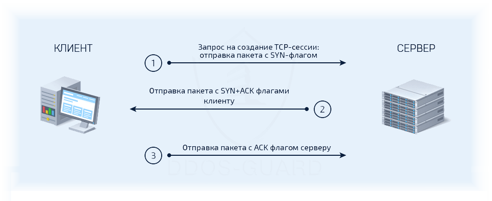
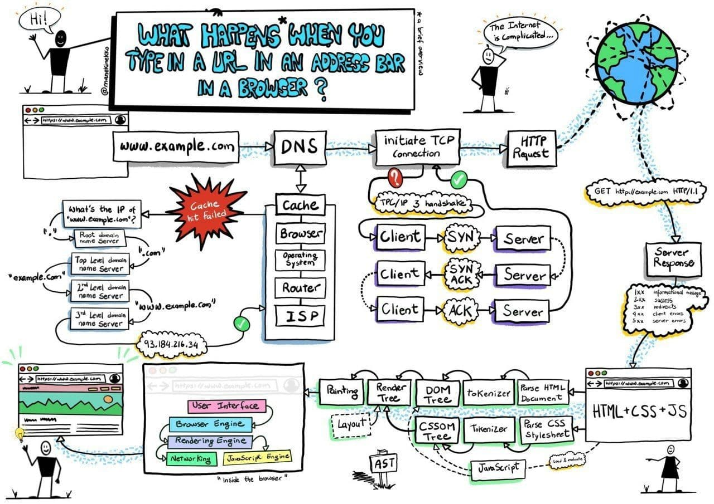
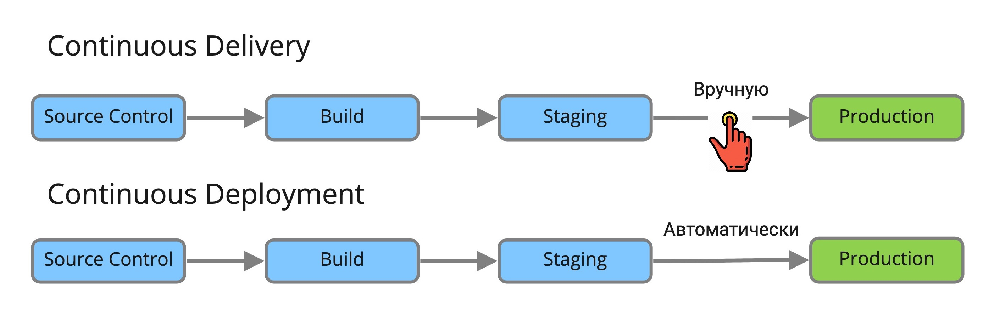

# Вопросы для собеседования на позицию администратора Linux и DevOps инженера.

---

## Linux. Basic

1. Что такое LA? В каких единицах измеряется?
<details>
  <summary>Ответ</summary>
LA (load average) -- параметр, определяющий среднюю нагрузку на систему за период времени (1 мин, 5 минут, 15 минут). Изменяется в количестве задач на одно ядро процессора. На нагрузку системы также влияет количество задач ввода-вывода и задержка сети. Также влияние на расчета LA оказывает: 1. Технология Hyper-Threading, которая делит одно физическое ядро на 2 логических, 2. Технология Turbo Bust, которая позволяет разгонять тактовую частоту процессора и работать на частоте выше заявленной, т.е. выше номинальной частоты (время на обработку одной задачи уменьшается). 
</details>

2. Что будет если на сервере LA = 100? 
<details>
  <summary>Ответ</summary>
  Вероятно, что на сервере будет наблюдаться замедленная работа сервисов, но если параметр LA равен количеству ядер в системе или количеству потоков в системе, то данная нагрузка является нормальной.
</details>

3. Почему при высоких показателях значения LA на сервере может не наблюдаться проблем (консоль ssh отзывается, сервисы работают в обычном режиме)?
<details>
  <summary>Ответ</summary>

На параметр нагрузки LA влияет также и ожидание ввода-вывода (параметр *wa* в утилите *top*) в дисков и задержка сети. Данные параметры могут не влиять на работу основных сервисов в системе, но учитываются при расчете общей нагрузки на систему. 

</details>

4. Представлен вывод команды *top*. Что означает каждая запись в выводе?
```
top - 21:29:24 up 14:18,  1 user,  load average: 0,78, 1,48, 1,10
Tasks: 277 total,   3 running, 274 sleeping,   0 stopped,   0 zombie
%Cpu(s): 12,4 us,  2,5 sy,  0,1 ni, 84,8 id,  0,1 wa,  0,0 hi,  0,1 si,  0,0 st
KiB Mem :  7106404 total,   306972 free,  3127144 used,  3672288 buff/cache
KiB Swap:  8191996 total,  8191996 free,        0 used.  3270520 avail Mem 
```

<details>
  <summary>Ответ</summary>

*top* - название утилиты.

*21:29:24* - текущее время системы.

*up 14:18* - сколько часов:минут система работает с момента последнего запуска.

*1 user* - количество пользователей авторизованных в системе.

*load average: 0,78, 1,48, 1,10* - параметр средней нагрузки на систему за период времени 1 минута, 5 минут, 15 минут.

*277 total* - всего процессов в системе.

*3 running* - количество процессов в работе.

*274 sleeping* - количество процессов в состоянии sleeping: ожидает какого-либо события или сигнала.

*0 stopped* - количество приостановленных процессов сигналом STOP или выполнением трассировки.

*0 zombie* - количество зомби-процессов, которые завершили своё выполнение, но присутствующие в системе, чтобы дать родительскому процессу считать свой код завершения.

| Параметр | Описание |
|-------------------------------|------------------------------------------------------------------------------------------------|
| us (user) | Использование процессора пользовательским процессами |
| sy (system) | Использование процессора системным процессами |
| ni (nice) | Использование процессора процессами с измененным приоритетом с помощью команды nice |
| id (idle) | Простой процессора. Можно сказать, что это свободные ресурсы |
| wa (IO-wait) | Говорит о простое, связанным с вводом/выводом |
| hi (hardware interrupts) | Показывает сколько процессорного времени было потрачено на обслуживание аппаратного прерывания |
| si (software interrupts) | Показывает сколько процессорного времени было потрачено на обслуживание софтверного прерывания |
| st (stolen by the hypervisor) | Показывает сколько процессорного времени было «украдено» гипервизором |

KiB Mem - количество оперативной памяти в кибибайтах (кратно 1024):
*7106404 total* -- всего доступно оперативной памяти в системе,
*306972 free* -- свободно оперативной памяти для использования,
*3127144 used* -- использовано оперативной памяти,
*3672288 buff/cache* -- буферизовано/закешировано оперативной памяти.

*KiB Swap* - количество swap-памяти в кибибайтах (кратно 1024), которые выделено на диске:
*8191996 total* - всего выделено swap-памяти,
*8191996 free* - свободно swap-памяти
*0 used* - использовано swap-памяти,
*3270520 avail Mem* - доступно для использования swap-памяти.

</details>

5. Как в утилите top в Linux посмотреть нагрузку на каждое ядро процессора?

<details>
  <summary>Ответ</summary>

В утилите top нажать `1`, чтобы отобразить все ядра в системе.

</details>

6. Как в утилите top в Linux посмотреть какой командой был запущен процесс?

<details>
  <summary>Ответ</summary>

В утилите top нажать `c`, чтобы отобразить команды, которыми были запущены процессы.

</details>

6. Как происходит HTTPS соединение?

<details>
  <summary>Ответ</summary>

</details>

7. Чем отличается TCP от UDP? Что лучше?

<details>
  <summary>Ответ</summary>

TCP – транспортный протокол передачи данных в сетях TCP/IP, предварительно устанавливающий соединение с сетью.
Ориентирован на соединение, используется для передачи данных (электронная почта, файлы, сообщения). При определении потери пакетов будет выполнен перезапрос потерянных пакетов.

UDP – транспортный протокол, передающий сообщения-датаграммы без необходимости установки соединения в IP-сети. Не ориентирован на установление соединения, используется в потоковой передаче данных (IPTV, VoIP). При потере пакетов перезапроса потерянных пакетов не происходит.

Нельзя сказать, что TCP лучше UDP, т.к. данные транспортные протоколы используются для различных типов передачи трафика.

</details>

8. Как происходит соединение TCP?

<details>
  <summary>Ответ</summary>



1. Клиент, который намеревается установить соединение, посылает серверу сегмент с номером последовательности и флагом SYN.
Дальнейший алгоритм:
Сервер получает сегмент, запоминает номер последовательности и пытается создать сокет (буферы и управляющие структуры памяти) для обслуживания нового клиента;
В случае успеха сервер посылает клиенту сегмент с номером последовательности и флагами SYN и ACK, и переходит в состояние SYN-RECEIVED;
​В случае неудачи сервер посылает клиенту сегмент с флагом RST.
2. Если клиент получает сегмент с флагом SYN, то он запоминает номер последовательности и посылает сегмент с флагом ACK.
Дальнейший алгоритм:
Если он одновременно получает и флаг ACK (что обычно и происходит), то он переходит в состояние ESTABLISHED;
Если клиент получает сегмент с флагом RST, то он прекращает попытки соединиться;
Если клиент не получает ответа в течение 10 секунд, то он повторяет процесс соединения заново.

3. Если сервер в состоянии SYN-RECEIVED получает сегмент с флагом ACK, то он переходит в состояние ESTABLISHED.
В противном случае после тайм-аута он закрывает сокет и переходит в состояние CLOSED.
Процесс называется «трёхэтапным рукопожатием» (англ. three way handshake), так как несмотря на то что возможен процесс установления соединения с использованием четырёх сегментов (SYN в сторону сервера, ACK в сторону клиента, SYN в сторону клиента, ACK в сторону сервера), на практике для экономии времени используется три сегмента.

</details>

9. Какие стандартные коды ответов есть у веб-серверов?

<details>
  <summary>Ответ</summary>

 - 1XX — информационные коды. Они отвечают за процесс передачи данных. Это временные коды, они информируют о том, что запрос принят и обработка будет продолжаться.
 - 2XX — успешная обработка. Запрос был получен и успешно обработан сервером.
 - 3XX — перенаправление (редирект). Эти ответы сервера гласят, что нужно предпринять дальнейшие действия для выполнения запроса. Например, сделать запрос по другому адресу.
 - 4XX — ошибка пользователя. Это значит, что запрос не может быть выполнен по его вине.
 - 5XX — ошибка сервера. Эти коды возникают из-за ошибок на стороне сервера. В данном случае пользователь всё сделал правильно, но сервер не может выполнить запрос. Для кодов этого класса сервер обязательно показывает сообщение, что не может обработать запрос и по какой причине.

</details>

10. Какие существуют основные типы запросов HTTP?

<details>
  <summary>Ответ</summary>

Два наиболее часто используемых видов HTTP запросов это: GET и POST.

GET - запрашивает данные с определенного ресурса (сайта).
POST - отправляет данные на сервер для последующей их обработки.

Особенности GET запроса:
 - Может быть закэширован
 - Остается в истории браузера
 - Может быть закладкой в браузере
 - Не должен использоваться при работе с крайне важными данными
 - Имеет ограниченную длину
 - Должен применяться только для получения данных

Особенности POST запроса:
 - Не кэшируется
 - Не может быть закладкой в браузере
 - Не остаётся в истории браузера
 - Нет ограничений по длине запроса

| Заголовок | Описание |
|-----------|---------------------------------------------------------------------------------------------|
| HEAD | Тоже самое что GET, однако возвращает только HTTP заголовки и не возвращает тело документа. |
| DELETE | Удаляет определенный ресурс. |
| PUT | Загружает представление определенного URI. |
| OPTIONS | Возвращает список видов запросов, поддерживаемых веб-сервером. |
| CONNECT | Создает прозрачный TCP/IP туннель для передачи запросов. |

</details>

11. Где хранятся имена файлов/директорий?
<details>
  <summary>Ответ</summary>

 - Inodes не содержат имён файлов, только другие метаданные файла. 
 - Каталоги Unix представляют собой списки ассоциативных структур, каждая из которых содержит одно имя файла и один номер индекса.
 - Драйвер файловой системы должен найти каталог, ищущий определенное имя файла, а затем преобразовать имя файла в правильный соответствующий номер индекса.

Таким образом имя файла/директории хранится в информационной структуре каталов.


</details>

12. Как удалить файл с именем `-rf`?

<details>
  <summary>Ответ</summary>

```
rm ./-rf
```

</details>

13. Как посмотреть описание дискриптора? Как посмотреть время последней модификации файла?

<details>
  <summary>Ответ</summary>

Посмотреть полную информацию по дискриптору возможно командой `stat <path_to_file>`.
Время модификации:
```
stat --format=%y dira
```

</details>

14. Для чего нужна переменная окружения PATH?

<details>
  <summary>Ответ</summary>

Переменная окружения PATH содержит абсолютные пути директорий, в которых производится поиск исполняемых файлов при вводе команд

</details>

15. Как посмотреть нагрузку на диски?

<details>
  <summary>Ответ</summary>

Установить утилиту `sysstat`, проверить нагрузку на диски `iostat -xtc`.

</details>

16. Клиент пишет, что заходит на свой сайт и он к нему подключается через раз. Что делать, что спрашивать от клиента? 

<details>
  <summary>Ответ</summary>

Необходимо спросить у клиента какую ошибку он наблюдает при неудачном запросе сайта, в какое время. Если проблема периодическая, то возможно проблема на стороне провайдера клиента. Необходимо запросить у клиента анализ сети с помощью утилит `traceroute`, `mtr` с того узла, где он наблюдает проблему и до сайта

</details>

17. Что такое 127.0.0.1 адрес? Для чего нужен?

<details>
  <summary>Ответ</summary>

</details>


## Linux.Main+

1. Что такое системный вызов, какие они бывают, какой командой их можно посмотреть?

<details>
  <summary>Ответ</summary>

</details>

2. Что такое сигнал в Unix, зачем они нужны и разница между 9 и 15 сигналами?

<details>
  <summary>Ответ</summary>

</details>

3. Что такое hard link? В чем разница между hard link и soft link? Примеры их практического применения.

<details>
  <summary>Ответ</summary>

</details>

4. Что такое inode? Какая информация там хранится?

<details>
  <summary>Ответ</summary>

</details>

5. Какие состояния процессов существуют? Что значит состояние процесса D?

<details>
  <summary>Ответ</summary>

</details>

6. Что такое зомби процесс? Можно ли самостоятельно сделать зомби?

<details>
  <summary>Ответ</summary>

</details>

7. Что такое файловый дескриптор? какая информация там хранится?

<details>
  <summary>Ответ</summary>

</details>

8. Что такое buffer/cache память? Для чего нужна?

9. Что такое RoundRobin DNS как работает? Какие записи бывают? Что такое DKIM, DMARC, PTR?

10. Как настроить master-slave репликацию в mysql?

<details>
  <summary>Ответ</summary>

</details>

11. Представлен вывод команды `free`.
```
$ free -m
              total        used        free      shared  buff/cache   available
Mem:           6930        3598         843         183        2489        2919
Swap:         15999           4       15995
```
Почему доступной (available) памяти сейчас 2919, если свободной (free) памяти 843?

<details>
  <summary>Ответ</summary>

!!! Дописать позже !!!

</details>

12. Вы вводите в строке браузера yandex.ru. Опишите процесс от нажатия клавиши до загрузки страницы.

<details>
  <summary>Ответ</summary>



!!! ОПИСАТЬ ПОДРОБНЕЕ !!!

</details>

## CI / CD

1. Чем отличается Continuous Integration от Continuous Delivery от Continuous Deployment?

<details>
  <summary>Ответ</summary>

Continuous Integration (непрерывная интеграция) - практика интеграции изменений кода из ветки разработки в основную ветку путём инструментов для интеграции.

Continuous Delivery (непрерывная доставка) - практика содержания кода в репозитории в состоянии пригодным для разворачивания на рабочее окружение.

Continuous Deployment (непрерывное разворачивание) - практика доставки каждого изменения в коде продукта на рабочее окружение.



Разница между Continuous Delivery и Continuous Deployment очень маленькая. Представим два пайплайна для одного и того же приложения. В каждом есть шаги:

1. Source Control - внесение изменений в систему контроля версий ПО.
2. Build - сборка приложения и прогон unit тестов
3. Staging - деплой на тестовое окружение, прогон интеграционных, нагрузочных и других тестов
4. Production - деплой на окружение с пользователями

Каждый пайплайн запускается автоматически по триггеру из системы контроля версий. В случае Continuous Deployment каждый следующий шаг, будет выполнен автоматически если предыдущий был успешный, включая деплой на Production.

Если же у вас Continuous Delivery, то шаги будут выполняться автоматически только в безопасной среде, а перед деплоем на Production пайплайн остановится и будет ждать ручного подтверждения. Механизм, как это будет реализовано может быть разным. От самого простого, когда ответственный человек должен зайти в пайплайн и нажать кнопку Next, до интерактивного бота с кнопками в корпоративном мессенджере.

</details>

## Terraform

1. Что содержит код Terraform?

<details>
  <summary>Ответ</summary>

Ресурсы облачного провайдера, а также провижининг для создаваемых ресурсов.

</details>

2. Как хранить состояние инфраструктуры в Terraform?

<details>
  <summary>Ответ</summary>

Например, можно хранить tfstate в git-репозитории команды. Другой вариант - хранить в специализированном Terraform Backend.

</details>

3. Terraform Backend. Какой лучше?

<details>
  <summary>Ответ</summary>

Зависит от требованиям к хранению состояния.

- AWS S3 — Standard (с locking через DynamoDB). Сохраняет состояние в виде заданного ключа в заданном сегменте на Amazon S3. Этот бэкэнд также поддерживает блокировку состояния и проверку согласованности через DynamoDB.

- terraform enterprise — Standard (без блокировки).

- etcd — Standard (без лока). Сохраняет состояние в etcd 2.x по заданному пути.

- etcdv3 — Standard (с блокировкой). Сохраняет состояние в хранилище etcd в виде K/V с заданным префиксом.

- gcs — Standard (с локом). Сохраняет состояние как объект в настраиваемом префиксе в заданном сегменте в Google Cloud Storage (GCS). Этот бэкэнд также поддерживает блокировку состояния.

Существуют также и другие Backend для Terraform.

</details>

4. Как добавить имеющиеся ресурсы в tfstate?

<details>
  <summary>Ответ</summary>

```
terraform import [options] ADDRESS ID
```
1. Например, создаем директорию и инициализируем будущую инфраструктуру:
```
mkdir terraform-test
cd terraform-test
terraform init
vi main.tf
```
2. Добавляем в файл main.tf следующий код:
```
provider "aws" {
  region = "us-west-1"
  profile = "tyx-local"
}
resource "aws_s3_bucket" "sample_bucket" {
  bucket = "tyx-local-bucket"
  acl = "public"
}
```
3. Выполняем импорт ресурса:
```
terraform import aws_s3_bucket.sample_bucket tyx-local-bucket
```

</details>

5. Зачем нужен `terraform taint`?

<details>
  <summary>Ответ</summary>

Команда `terraform taint` пометит ресурс инфраструктуры, который будет удален и заново создан при следующем применении команды `terraform apply`. 

</details>

6. Как проводить тестирование terraform?

<details>
  <summary>Ответ</summary>

`terraforn plan` выполнит проверку действующего кода. Работу с облачными ресурсами выполнит 

</details>

## Docker

1. Что такое Docker? В чем отличие контейнера от образа?

<details>
  <summary>Ответ</summary>

Docker - программное обеспечение для автоматизации развёртывания и управления приложениями в средах с поддержкой контейнеризации.

Образ - шаблон приложения, который содержит слои файловой системы в режиме "только-чтение".

Контейнер - запущенный образ приложения, который кроме нижних слоев в режиме "только чтение" содержит верхний слой в режиме "чтение-запись".

</details>

2. Какие инструкции есть у Dockerfile?
<details>
  <summary>Ответ</summary>

| Инструкция | Описание |
|------------|--------------------------------------------------------------------------------------------------------------------------------------------------------------------------------------------------------------|
| FROM | Задаёт базовый (родительский) образ. |
| LABEL | Описывает метаданные. Например — сведения о том, кто создал и поддерживает образ. |
| ENV | Устанавливает постоянные переменные среды. |
| RUN | Выполняет команду и создаёт слой образа. Используется для установки в контейнер пакетов. |
| COPY | Копирует в контейнер файлы и директории. |
| ADD | Копирует файлы и директории в контейнер, может распаковывать локальные .tar-файлы. |
| CMD | Описывает команду с аргументами, которую нужно выполнить когда контейнер будет запущен. Аргументы могут быть переопределены при запуске контейнера. В файле может присутствовать лишь одна инструкция CMD. |
| WORKDIR | Задаёт рабочую директорию для следующей инструкции. |
| ARG | Задаёт переменные для передачи Docker во время сборки образа. |
| ENTRYPOINT | Предоставляет команду с аргументами для вызова во время выполнения контейнера. Аргументы не переопределяются. |
| EXPOSE | Указывает на необходимость открыть порт. |
| VOLUME | Создаёт точку монтирования для работы с постоянным хранилищем. |

</details>

3. Чем отличается *CMD* от *ENTRYPOINT* в Dockerfile?

<details>
  <summary>Ответ</summary>

Инструкции CMD и ENTRYPOINT выполняются в момент запуска контейнера, тольо инструкция CMD позволяет переопределить передаваемые команде аргументы.

**Пример 1. CMD:**
Опишем сборку образа в Dockerfile.
```
FROM alpine  
CMD ["ping", "8.8.8.8"]  
```
В инструкцию CMD передаются 2 аргумента. Выполним сборку образа `docker build -t test .` и запустим контейнер.
```
$ docker run test
PING 8.8.8.8 (8.8.8.8): 56 data bytes
64 bytes from 8.8.8.8: seq=0 ttl=43 time=32.976 ms
64 bytes from 8.8.8.8: seq=1 ttl=43 time=31.998 ms
64 bytes from 8.8.8.8: seq=2 ttl=43 time=31.843 ms
--- 8.8.8.8 ping statistics ---
3 packets transmitted, 3 packets received, 0% packet loss
round-trip min/avg/max = 31.708/33.316/36.823 ms
```
Теперь передадим 2 новых аргумента для запуска контейнера.
```
$ docker run test traceroute 1.1.1.1
traceroute to 1.1.1.1 (1.1.1.1), 30 hops max, 46 byte packets
 1  172.17.0.1 (172.17.0.1)  0.017 ms  0.016 ms  0.009 ms
 2  192.168.168.1 (192.168.168.1)  0.996 ms  1.553 ms  2.069 ms
 3  *  *  *
 4  lag-2-435.bgw01.samara.ertelecom.ru (85.113.62.125)  1.454 ms  1.427 ms  1.984 ms
 5  172.68.8.3 (172.68.8.3)  19.685 ms  15.722 ms  15.565 ms
 6  172.68.8.2 (172.68.8.2)  15.846 ms  22.696 ms  35.093 ms
 7  one.one.one.one (1.1.1.1)  17.439 ms  17.670 ms  24.202 ms
```
`ping` заменен на traceroute, IP адрес заменен на 1.1.1.1.

**Пример 2. ENTRYPOINT:**
Опишем сборку образа в Dockerfile.
```
FROM alpine  
ENTRYPOINT ["ping", "8.8.8.8"]
```
В инструкцию ENTRYPOINT передаются 2 аргумента. Выполним сборку образа `docker build -t test .` и запустим контейнер.
```
$ docker run test2
PING 8.8.8.8 (8.8.8.8): 56 data bytes
64 bytes from 8.8.8.8: seq=0 ttl=43 time=36.189 ms
64 bytes from 8.8.8.8: seq=1 ttl=43 time=44.120 ms
64 bytes from 8.8.8.8: seq=2 ttl=43 time=44.584 ms
^C
--- 8.8.8.8 ping statistics ---
3 packets transmitted, 3 packets received, 0% packet loss
round-trip min/avg/max = 36.189/41.631/44.584 ms
```
Теперь передадим изменим один из аргументов для запуска контейнера.
```
$ docker run test2 ping 1.1.1.1
BusyBox v1.31.1 () multi-call binary.

Usage: ping [OPTIONS] HOST

Send ICMP ECHO_REQUEST packets to network hosts

	-4,-6		Force IP or IPv6 name resolution
	-c CNT		Send only CNT pings
	-s SIZE		Send SIZE data bytes in packets (default 56)
	-i SECS		Interval
	-A		Ping as soon as reply is recevied
	-t TTL		Set TTL
	-I IFACE/IP	Source interface or IP address
	-W SEC		Seconds to wait for the first response (default 10)
			(after all -c CNT packets are sent)
	-w SEC		Seconds until ping exits (default:infinite)
			(can exit earlier with -c CNT)
	-q		Quiet, only display output at start
			and when finished
	-p HEXBYTE	Pattern to use for payload
```
Как видим, аргумент передать контейнеру нельзя.

**Пример 3. ENTRYPOINT и CMD:**
Опишем сборку образа в Dockerfile.
```
FROM alpine  
ENTRYPOINT ["ping"]
CMD ["8.8.8.8"]
```
В инструкцию ENTRYPOINT передаётся аргумент `ping`, в CMD передаётся аргумент 8.8.8.8. Выполним сборку образа `docker build -t test .` и запустим контейнер.
```
$ docker run test3
PING 8.8.8.8 (8.8.8.8): 56 data bytes
64 bytes from 8.8.8.8: seq=0 ttl=43 time=41.176 ms
64 bytes from 8.8.8.8: seq=1 ttl=43 time=32.875 ms
64 bytes from 8.8.8.8: seq=2 ttl=43 time=40.395 ms
^C
--- 8.8.8.8 ping statistics ---
3 packets transmitted, 3 packets received, 0% packet loss
round-trip min/avg/max = 32.875/38.148/41.176 ms
```
Пробуем изменить 2 аргумента.
```
$ docker run test3 traceroute 1.1.1.1
BusyBox v1.31.1 () multi-call binary.

Usage: ping [OPTIONS] HOST

Send ICMP ECHO_REQUEST packets to network hosts

	-4,-6		Force IP or IPv6 name resolution
	-c CNT		Send only CNT pings
	-s SIZE		Send SIZE data bytes in packets (default 56)
	-i SECS		Interval
	-A		Ping as soon as reply is recevied
	-t TTL		Set TTL
	-I IFACE/IP	Source interface or IP address
	-W SEC		Seconds to wait for the first response (default 10)
			(after all -c CNT packets are sent)
	-w SEC		Seconds until ping exits (default:infinite)
			(can exit earlier with -c CNT)
	-q		Quiet, only display output at start
			and when finished
	-p HEXBYTE	Pattern to use for payload
```
Изменить 2 аргумента невозможно. Заменим аргумент инструкции CMD.
```
$ docker run test3 1.1.1.1    
PING 1.1.1.1 (1.1.1.1): 56 data bytes
64 bytes from 1.1.1.1: seq=0 ttl=58 time=31.412 ms
64 bytes from 1.1.1.1: seq=1 ttl=58 time=19.400 ms
64 bytes from 1.1.1.1: seq=2 ttl=58 time=15.814 ms
^C
--- 1.1.1.1 ping statistics ---
3 packets transmitted, 3 packets received, 0% packet loss
round-trip min/avg/max = 15.814/22.208/31.412 ms
```
При такой сборке образа команды ENTRYPOINT и CMD при запуске контейнера будут запущены последовательно, но аргумент возможно изменить только для CMD.

</details>

4. Чем отличается *COPY* от *ADD* в Dockerfile?

<details>
  <summary>Ответ</summary>

Инструкция *COPY* копируют файлы и директории с хостовой машины внутрь контейнера, инструкция *ADD* копирует файлы и директории с хостовой машины внутрь контейнера и может распаковывать .tar архивы.

</details>

5. Какие есть best practices для написания Dockerfile, docker-compose?

<details>
  <summary>Ответ</summary>

1. Стараться объединять несколько команд RUN в одну для уменьшения количества слоёв образа.
2. Частоизменяемые слои образа необходимо располагать ниже по уровню, чтобы ускорить процесс сборки, т.к. при изменении верхнего слоя, все нижеследующие слои будут пересобираться.
3. Указывать явные версии образов в инструкции FROM, чтобы избежать случая, когда выйдет новая версия образа с тегом latest.
4. При установке пакетов указывать версии пакетов.
5. Очищать кеш пакетного менеджера и удалять ненужные файлы после выполненной инструкции.

</details>

## Ansible

1. Чем отличаются Ansible модули *raw*, *command* и *shell*?

<details>
  <summary>Ответ</summary>

Модуль *raw* отличается от *command* и *shell* тем, что не выполняет дополнительную обработку выполнения команды. Эти дополнительные обработки присутствуют в почти любом модуле Ansible. Модуль *raw* передает команду, как есть, в "сыром" (raw) виде без проверок.
Модули *command* и *shell* отличаются тем, что в модуле *command* команда выполняется без прохождения через командную оболочку `/bin/sh`. Поэтому переменные определенные в оболочке и перенаправления - конвееры работать не будут. Модуль *shell* выполняет команды через оболочку по умолчанию `/bin/sh`. Поэтому там будут доступны переменные оболочки и перенаправления.

</details>

## Kubernetes

1. Чем отличается Kubernetes от Openshift?

<details>
  <summary>Ответ</summary>

https://www.redhat.com/cms/managed-files/cl-openshift-and-kubernetes-ebook-f25170wg-202010-en.pdf

!!! Переписать отличия по ссылке !!!

</details>

2. Чем отличаются ReplicaController от ReplicaSet?

<details>
  <summary>Ответ</summary>

ReplicationController гарантирует, что указанное количество реплик подов будут работать одновременно. Другими словами, ReplicationController гарантирует, что под или набор подов всегда активен и доступен.

ReplicaSet - это следующее поколение Replication Controller. Единственная разница между ReplicaSet и Replication Controller - это поддержка селектора. ReplicaSet поддерживает множественный выбор в селекторе, тогда как Replication Controller поддерживает в селекторе только выбор на основе равенства.

</details>

3. Если на каждой ноде Kubernetes кластера нужно запустить контейнер, то какой ресурс Kubernetes вам подойдет?

<details>
  <summary>Ответ</summary>

DaemonSet является контроллером, основным назначением которого является запуск подов на всех нодах кластера. Если нода добавляется/удаляется — DaemonSet автоматически добавит/удалит под на этой ноде.

DaemonSet подходят для запуска приложений, которые должны работать на всех нодах, например — екпортёры мониторинга, сбор логов и так далее.

</details>

4. Как поды разнести на разные ноды?

<details>
  <summary>Ответ</summary>

Необходимо настроить podAntiAffinity. Данное указание определяет, что для определенных подов следует использовать их размещание на разных нодах.

</details>

5. Как контейнеры одного пода разнести на разные ноды?

<details>
  <summary>Ответ</summary>

Никак.

</details>

6. Как обеспечить, чтобы поды никогда не перешли в состояние Evicted на ноде? 

<details>
  <summary>Ответ</summary>


</details>

7. За что отвечает kube-proxy?

<details>
  <summary>Ответ</summary>

Kube-proxy отвечает за взаимодействие между сервисами на разных нодах кластера.

</details>

8. Что находится на master ноде?

<details>
  <summary>Ответ</summary>

- Kube-apiserver отвечает за оркестрацию всех операций кластера.
- Controller-manager (Node controller + Replication Controller) Controller отвечает за функции контроля за нодами, репликами.
- ETCD cluster (распределенное хранилище ключ-значение) ETCD хранит информацию о кластере и его конфигурацию.
- Kube-sheduler отвечает за планирование приложений и контейнеров на нодах.

По-умолчанию на master ноде не размещаются контейнеры приложений, но данный фунционал возможно настроить.

</details>

9. Что находится на worker ноде?

<details>
  <summary>Ответ</summary>

- Kubelet слушает инструкции от kube-apiserver и разворачивает или удаляет контейнеры на нодах.
- Kube-proxy отвечает за взаимодействие между сервисами на разных нодах кластера.

На worker нодах по-умолчанию размещаются контейнеры приложений. На каждой ноде кластера устанавливается Docker или другая платформа контейнеризации (например RKT или containterd). На Master ноде также устанавливается Docker, если необходимо использовать компоненты Kubernetes в контейнерах.

</details>

10. Как установить Kubernetes?

<details>
  <summary>Ответ</summary>

1. Следовать инструкции [установки kubeadm](https://kubernetes.io/docs/setup/production-environment/tools/kubeadm/install-kubeadm/).

2. Установка с [использованием kubespray](https://github.com/kubernetes-sigs/kubespray).

</details>

11. Чем отличается StatefulSet от Deployment?

<details>
  <summary>Ответ</summary>

!!! Написать точную инфу тут !!!

</details>

12. Что такое *операторы* в понятиях Kubernetes?

<details>
  <summary>Ответ</summary>

Операторы -- это программные расширения Kubernetes,призванное автоматизировать выполнение рутинных действий над объектами кластера при определённых событиях.

Оператор работает по подписке на события к API Kubernetes.

</details>

13. Почему DaemonSet не нужен scheduler?

<details>
  <summary>Ответ</summary>

DaemonSet гарантирует, что определенный под будет запущен на всех нодах кластера. При наличии DaemonSet в кластере на любой из существующих и будущих нод в кластере зарезервированы ресурсы для пода на ноде.

</details>

14. В каких случаях не отработает перенос пода на другую ноду?

<details>
  <summary>Ответ</summary>

Если на другой ноде нет ресурсов для размещения пода или нет сетевой доступности до ноды.

</details>

15. Что делает ControllerManager?

<details>
  <summary>Ответ</summary>

Controller выполняет постоянный процесс мониторинга состояния кластера и различных компонент.

Controller-manager (Node controller + Replication Controller) - Controller отвечает за функции контроля за нодами, репликами.

</details>

16. Администратор выполняет команду `kubectl apply -f deployment.yaml`. Опишите по порядку что происходит в каждом из узлов Kubernetes и в каком порядке.

<details>
  <summary>Ответ</summary>

!!! Написать полный ответ позже !!!

</details>

17. Как выполнить обновление Kubernetes в контуре где нет интернета?

<details>
  <summary>Ответ</summary>

!!! Записать полный ответ тут !!!

</details>

18. Чем Router в Openshift отличается от Ingress в Kubernetes?

<details>
  <summary>Ответ</summary>

Router Openshift использует haproxy, как прокси-вебсервер. Ingress как в Kubernetes, так и OpenShift может быть разным (nginx, haproxy, caddy, etc).

!!! Вставить сюда таблицу со сравнением !!!

</details>

19. Почему для установки Kubernetes требуется отключить swap?

<details>
  <summary>Ответ</summary>

Планировщик Kubernetes определяет наилучший доступный узел для развертывания вновь созданных модулей. Если в хост-системе разрешена подкачка памяти, это может привести к проблемам с производительностью и стабильностью в Kubernetes. По этой причине Kubernetes требует, чтобы вы отключили swap в хост-системе.

</details>

20. Что такое pod в Kubernetes?

<details>
  <summary>Ответ</summary>

!!! Добвить описание !!!

</details>

## Неотсортированное

25. Какими файрволами работал? Какие у iptables есть цепочки и таблицы и для чего нужны? Как сделать NAT?
27. Какими способами можно организовать балансировку?


Также почитайте про Nginx и его асинхронный принцип работы, ( одно из основных отличий от Apache  и др. серверов приложений)

Также, если нужно, повторите модель OSI, какие протоколы на каком уровне используются


28. Назовите главные отличия nginx от apache.

<details>
  <summary>Ответ</summary>

!!! Добавить описание !!!
Выжимку отсюда можно взять: https://habr.com/ru/post/267721/

</details>

29. Расскажите, что произойдёт при вводе команды: ./sh.sh !? 2 > 1 2 > &1 1 < 3

<details>
  <summary>Ответ</summary>

Alex Tsykunov: !?<любая часть of command> парсится в последнюю команду которая соответствует следующему аргументу:\
[root@m]# cat linux2007\
Hellom Linux 2007\
[root@my]# !?2007\
cat linux2007\
Hellom Linux 2007

[root@m]# echo cat linux2007\
cat linux2007\
[root@m]# echo !? linux2007\
echo echo cat linux2007\
echo cat linux2007

!!! Ответ к доработке !!!

</details>

30. Чем terraform отличается от ansible?

<details>
  <summary>Ответ</summary>

</details>

31. Имеете ли вы опыт построения отказоустойчивых решений с БД MySQL, PostgreSQL? Если да, какие решения использовали?

<details>
  <summary>Ответ</summary>

</details>

32. Имеете ли вы опыт построения и/или сопровождения высоконагруженных веб-проектов? Если да, опишите ваш опыт.
<details>
  <summary>Ответ</summary>

</details>

34. Сеть/routes

Есть две изолированные сети /25 - 192.168.1.0 (gw: 192.168.1.1), 192.168.1.128 (gw: 192.168.1.129).
Есть два сервера со следующими таблицами маршрутизации

192.168.1.3
routes
0.0.0.0/0 192.168.1.1

192.168.1.146
routes
192.168.1.128/24 192.168.1.129

Что нужно сделать, чтобы эти сервера "видели" друг друга?

35. В конфиге nginx некоторого проекта есть два десятка различных location, которые делятся на три базовых типа - memcache, dynamic, static. Лог проекта единый, но для анализа требуется различать записи в логе каким-либо способом. По именам файлов тип location различить нельзя, разделить на три лога также нельзя. Предложите решение.

<details>
  <summary>Ответ (вариант)</summary>
Использовать вывод в syslog и определить tag.
Например:
location /memcache {
  access_log syslog:server=unix:/dev/log,tag=nginx_memcache;
  error_log syslog:server=unix:/dev/log,tag=nginx_memcache;
}

location /dynamic {
  access_log syslog:server=unix:/dev/log,tag=nginx_dynamic;
  error_log syslog:server=unix:/dev/log,tag=nginx_dynamic;
}

/static - соответственно. Вывод в определенный файл syslog можно указать опцией :syslogtag
</details>

36. Ansible. На всех серверах должен быть набор пользователей, с доступом по ssh-ключу, стандартный модуль user не позволяет вносить ssh ключ в authorized_keys. Предложите решение.

37. Ansible. (*) Есть группы пользователей, которые должны заводиться не на всех серверах. Как ограничить заведение пользователей.

---
