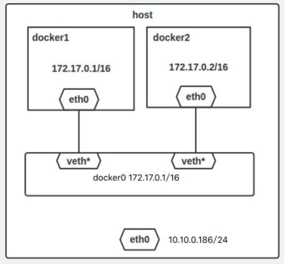

## Docker

1. Что такое Docker? В чем отличие контейнера от образа?

<details>
  <summary>Ответ</summary>

Docker - программное обеспечение для автоматизации развёртывания и управления приложениями в средах с поддержкой контейнеризации.

Образ - шаблон приложения, который содержит слои файловой системы в режиме "только-чтение".

Контейнер - запущенный образ приложения, который кроме нижних слоев в режиме "только чтение" содержит верхний слой в режиме "чтение-запись".

</details>

2. Какие инструкции есть у Dockerfile?
<details>
  <summary>Ответ</summary>

| Инструкция | Описание |
|------------|--------------------------------------------------------------------------------------------------------------------------------------------------------------------------------------------------------------|
| FROM | Задаёт базовый (родительский) образ. |
| LABEL | Описывает метаданные. Например — сведения о том, кто создал и поддерживает образ. |
| ENV | Устанавливает постоянные переменные среды. |
| RUN | Выполняет команду и создаёт слой образа. Используется для установки в контейнер пакетов. |
| COPY | Копирует в контейнер файлы и директории. |
| ADD | Копирует файлы и директории в контейнер, может распаковывать локальные .tar-файлы. |
| CMD | Описывает команду с аргументами, которую нужно выполнить когда контейнер будет запущен. Аргументы могут быть переопределены при запуске контейнера. В файле может присутствовать лишь одна инструкция CMD. |
| WORKDIR | Задаёт рабочую директорию для следующей инструкции. |
| ARG | Задаёт переменные для передачи Docker во время сборки образа. |
| ENTRYPOINT | Предоставляет команду с аргументами для вызова во время выполнения контейнера. Аргументы не переопределяются. |
| EXPOSE | Указывает на необходимость открыть порт. |
| VOLUME | Создаёт точку монтирования для работы с постоянным хранилищем. |

</details>

3. Чем отличается *CMD* от *ENTRYPOINT* в Dockerfile?

<details>
  <summary>Ответ</summary>

Инструкции CMD и ENTRYPOINT выполняются в момент запуска контейнера, тольо инструкция CMD позволяет переопределить передаваемые команде аргументы.

**Пример 1. CMD:**
Опишем сборку образа в Dockerfile.
```
FROM alpine  
CMD ["ping", "8.8.8.8"]  
```
В инструкцию CMD передаются 2 аргумента. Выполним сборку образа `docker build -t test .` и запустим контейнер.
```
$ docker run test
PING 8.8.8.8 (8.8.8.8): 56 data bytes
64 bytes from 8.8.8.8: seq=0 ttl=43 time=32.976 ms
64 bytes from 8.8.8.8: seq=1 ttl=43 time=31.998 ms
64 bytes from 8.8.8.8: seq=2 ttl=43 time=31.843 ms
--- 8.8.8.8 ping statistics ---
3 packets transmitted, 3 packets received, 0% packet loss
round-trip min/avg/max = 31.708/33.316/36.823 ms
```
Теперь передадим 2 новых аргумента для запуска контейнера.
```
$ docker run test traceroute 1.1.1.1
traceroute to 1.1.1.1 (1.1.1.1), 30 hops max, 46 byte packets
 1  172.17.0.1 (172.17.0.1)  0.017 ms  0.016 ms  0.009 ms
 2  192.168.168.1 (192.168.168.1)  0.996 ms  1.553 ms  2.069 ms
 3  *  *  *
 4  lag-2-435.bgw01.samara.ertelecom.ru (85.113.62.125)  1.454 ms  1.427 ms  1.984 ms
 5  172.68.8.3 (172.68.8.3)  19.685 ms  15.722 ms  15.565 ms
 6  172.68.8.2 (172.68.8.2)  15.846 ms  22.696 ms  35.093 ms
 7  one.one.one.one (1.1.1.1)  17.439 ms  17.670 ms  24.202 ms
```
`ping` заменен на traceroute, IP адрес заменен на 1.1.1.1.

**Пример 2. ENTRYPOINT:**
Опишем сборку образа в Dockerfile.
```
FROM alpine  
ENTRYPOINT ["ping", "8.8.8.8"]
```
В инструкцию ENTRYPOINT передаются 2 аргумента. Выполним сборку образа `docker build -t test .` и запустим контейнер.
```
$ docker run test2
PING 8.8.8.8 (8.8.8.8): 56 data bytes
64 bytes from 8.8.8.8: seq=0 ttl=43 time=36.189 ms
64 bytes from 8.8.8.8: seq=1 ttl=43 time=44.120 ms
64 bytes from 8.8.8.8: seq=2 ttl=43 time=44.584 ms
^C
--- 8.8.8.8 ping statistics ---
3 packets transmitted, 3 packets received, 0% packet loss
round-trip min/avg/max = 36.189/41.631/44.584 ms
```
Теперь передадим изменим один из аргументов для запуска контейнера.
```
$ docker run test2 ping 1.1.1.1
BusyBox v1.31.1 () multi-call binary.

Usage: ping [OPTIONS] HOST

Send ICMP ECHO_REQUEST packets to network hosts

	-4,-6		Force IP or IPv6 name resolution
	-c CNT		Send only CNT pings
	-s SIZE		Send SIZE data bytes in packets (default 56)
	-i SECS		Interval
	-A		Ping as soon as reply is recevied
	-t TTL		Set TTL
	-I IFACE/IP	Source interface or IP address
	-W SEC		Seconds to wait for the first response (default 10)
			(after all -c CNT packets are sent)
	-w SEC		Seconds until ping exits (default:infinite)
			(can exit earlier with -c CNT)
	-q		Quiet, only display output at start
			and when finished
	-p HEXBYTE	Pattern to use for payload
```
Как видим, аргумент передать контейнеру нельзя.

**Пример 3. ENTRYPOINT и CMD:**
Опишем сборку образа в Dockerfile.
```
FROM alpine  
ENTRYPOINT ["ping"]
CMD ["8.8.8.8"]
```
В инструкцию ENTRYPOINT передаётся аргумент `ping`, в CMD передаётся аргумент 8.8.8.8. Выполним сборку образа `docker build -t test .` и запустим контейнер.
```
$ docker run test3
PING 8.8.8.8 (8.8.8.8): 56 data bytes
64 bytes from 8.8.8.8: seq=0 ttl=43 time=41.176 ms
64 bytes from 8.8.8.8: seq=1 ttl=43 time=32.875 ms
64 bytes from 8.8.8.8: seq=2 ttl=43 time=40.395 ms
^C
--- 8.8.8.8 ping statistics ---
3 packets transmitted, 3 packets received, 0% packet loss
round-trip min/avg/max = 32.875/38.148/41.176 ms
```
Пробуем изменить 2 аргумента.
```
$ docker run test3 traceroute 1.1.1.1
BusyBox v1.31.1 () multi-call binary.

Usage: ping [OPTIONS] HOST

Send ICMP ECHO_REQUEST packets to network hosts

	-4,-6		Force IP or IPv6 name resolution
	-c CNT		Send only CNT pings
	-s SIZE		Send SIZE data bytes in packets (default 56)
	-i SECS		Interval
	-A		Ping as soon as reply is recevied
	-t TTL		Set TTL
	-I IFACE/IP	Source interface or IP address
	-W SEC		Seconds to wait for the first response (default 10)
			(after all -c CNT packets are sent)
	-w SEC		Seconds until ping exits (default:infinite)
			(can exit earlier with -c CNT)
	-q		Quiet, only display output at start
			and when finished
	-p HEXBYTE	Pattern to use for payload
```
Изменить 2 аргумента невозможно. Заменим аргумент инструкции CMD.
```
$ docker run test3 1.1.1.1    
PING 1.1.1.1 (1.1.1.1): 56 data bytes
64 bytes from 1.1.1.1: seq=0 ttl=58 time=31.412 ms
64 bytes from 1.1.1.1: seq=1 ttl=58 time=19.400 ms
64 bytes from 1.1.1.1: seq=2 ttl=58 time=15.814 ms
^C
--- 1.1.1.1 ping statistics ---
3 packets transmitted, 3 packets received, 0% packet loss
round-trip min/avg/max = 15.814/22.208/31.412 ms
```
При такой сборке образа команды ENTRYPOINT и CMD при запуске контейнера будут запущены последовательно, но аргумент возможно изменить только для CMD.

</details>

4. Чем отличается *COPY* от *ADD* в Dockerfile?

<details>
  <summary>Ответ</summary>

Инструкция *COPY* копируют файлы и директории с хостовой машины внутрь контейнера, инструкция *ADD* копирует файлы и директории с хостовой машины внутрь контейнера и может распаковывать .tar архивы.

</details>

5. Какие есть best practices для написания Dockerfile?

<details>
  <summary>Ответ</summary>

1. Запускать только один процесс на контейнер.
2. Стараться объединять несколько команд RUN в одну для уменьшения количества слоёв образа.
3. Частоизменяемые слои образа необходимо располагать ниже по уровню, чтобы ускорить процесс сборки, т.к. при изменении верхнего слоя, все нижеследующие слои будут пересобираться.
4. Указывать явные версии образов в инструкции FROM, чтобы избежать случая, когда выйдет новая версия образа с тегом latest.
5. При установке пакетов указывать версии пакетов.
6. Очищать кеш пакетного менеджера и удалять ненужные файлы после выполненной инструкции.
7. Использовать multistage build для сборки артифакта в одном контейнере и размещении его в другом.

</details>

6. Какие типы сетевых драйверов используются в docker?

<details>
  <summary>Ответ</summary>

Основные драйвера сетей docker: bridge, host, overlay, ipvlan, macvlan, none

**bridge:** это сетевой драйвер по умолчанию. Бридж сеть используется, когда ваши приложения запускаются в автономных контейнерах, которые должны взаимодействовать между собой. 

Взаимодействие с хостом выполняется через мост docker0 и конфигурацию таблицы iptables nat. В этом режиме будет выделено сетевое пространство имен, задан IP-адрес для каждого контейнера, а контейнер Docker на хосте будет подключен к виртуальному мосту. Виртуальный мост работает как физический коммутатор, поэтому все контейнеры на хосте подключены к сети уровня 2 через коммутатор.

**host:** использует сеть хоста напрямую без изоляции контейнера и хоста.

**none:** этот режим помещает контейнер в свой собственный сетевой стек, но не выполняет никакой настройки. Фактически, этот режим отключает сетевую функцию контейнера, что полезно в следующих двух ситуациях: контейнер не требует сети (например, только для пакетной задачи записи дисковых томов).

**macvlan:** в режиме Macvlan Bridge каждый контейнер имеет уникальный MAC-адрес, который используется для отслеживания сопоставления MAC-адреса с портом хоста Docker. Сеть драйвера Macvlan подключается к родительскому интерфейсу хоста Docker. Примерами являются физические интерфейсы, такие как eth0, субинтерфейс eth0.10 для тегирования VLAN 802.1q (.10 означает VLAN 10) или даже связанный хост-адаптер, который объединяет два интерфейса Ethernet в единый логический интерфейс. Назначенный шлюз является внешним по отношению к хосту, предоставляемому сетевой инфраструктурой. Каждая сеть Docker в режиме Macvlan Bridge изолирована друг от друга, и только одна сеть может быть подключена к родительскому узлу одновременно. Каждый хост-адаптер имеет теоретический предел, и каждый хост-адаптер может подключаться к сети Docker. Любой контейнер в той же подсети может взаимодействовать с любым другим контейнером в той же сети без шлюзового моста macvlan. Та же сетевая команда docker применяется к драйверу vlan. В режиме Macvlan без внешней маршрутизации процессов между двумя сетями / подсетями контейнеры в разных сетях не могут получить доступ друг к другу. Это также относится к нескольким подсетям в одной и той же терминальной сети.

**overlay:** Оверлейные сети соединяют несколько демонов Docker вместе и позволяют сервисам swarm взаимодействовать друг с другом. Вы также можете использовать оверлейные сети для облегчения связи между сервисом swarm и автономным контейнером или между двумя автономными контейнерами в разных демонах Docker. Эта стратегия устраняет необходимость выполнять маршрутизацию между этими контейнерами на уровне ОС.

**ipvlan:** Сети ipvlan предоставляют пользователям полный контроль над адресацией IPv4 и IPv6. Драйвер VLAN построен на основе этой возможности, предоставляя операторам полный контроль над тегированием VLAN уровня 2 и даже маршрутизацией IPvlan L3 для пользователей.

</details>

7. Что такое эфемерные контейнеры?

<details>
  <summary>Ответ</summary>

[Эфемерные контейнеры](https://kubernetes.io/docs/concepts/workloads/pods/ephemeral-containers/) стали бета-функцией в Kubernetes v1.23 и теперь включены по умолчанию.
Эфемерные контейнеры предназначены для транзитных задач, когда вам нужно временно [подключить дополнительный контейнер к существующему поду](https://kubernetes.io/docs/tasks/debug/debug-application/debug-running-pod/#ephemeral-container). Это идеально подходит для отладочных операций, когда вы хотите проверить поды, не затрагивая живые экземпляры контейнеров.

</details>