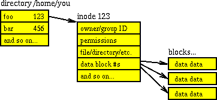

## Linux. Basic

1. Что такое LA? В каких единицах измеряется?
<details>
  <summary>Ответ</summary>
  LA (load average) -- параметр, определяющий среднюю нагрузку на систему за период времени (1 мин, 5 минут, 15 минут). Изменяется в количестве задач на одно ядро процессора. На нагрузку системы также влияет количество задач ввода-вывода и задержка сети. Также влияние на расчета LA оказывает: 1. Технология Hyper-Threading, которая делит одно физическое ядро на 2 логических, 2. Технология Turbo Bust, которая позволяет разгонять тактовую частоту процессора и работать на частоте выше заявленной, т.е. выше номинальной частоты (время на обработку одной задачи уменьшается). 
</details>

2. Что будет если на сервере LA = 100? 
<details>
  <summary>Ответ</summary>
  Вероятно, что на сервере будет наблюдаться замедленная работа сервисов, но если параметр LA равен количеству ядер в системе или количеству потоков в системе, то данная нагрузка является нормальной.
</details>

3. Почему при высоких показателях значения LA на сервере может не наблюдаться проблем (консоль ssh отзывается, сервисы работают в обычном режиме)?
<details>
  <summary>Ответ</summary>

  На параметр нагрузки LA влияет также и ожидание ввода-вывода (параметр *wa* в утилите *top*) в дисков и задержка сети. Данные параметры могут не влиять на работу основных сервисов в системе, но учитываются при расчете общей нагрузки на систему. 

</details>

4. Представлен вывод команды *top*. Что означает каждая запись в выводе?
   ```
   top - 21:29:24 up 14:18,  1 user,  load average: 0,78, 1,48,   1,10
   Tasks: 277 total,   3 running, 274 sleeping,   0 stopped,      0 zombie
   %Cpu(s): 12,4 us,  2,5 sy,  0,1 ni, 84,8 id,  0,1 wa,  0,0   hi,  0,1 si,  0,0 st
   KiB Mem :  7106404 total,   306972 free,  3127144 used,    3672288 buff/cache
   KiB Swap:  8191996 total,  8191996 free,        0 used.    3270520 avail Mem 
   ```

<details>
  <summary>Ответ</summary>

*top* - название утилиты.

*21:29:24* - текущее время системы.

*up 14:18* - сколько часов:минут система работает с момента последнего запуска.

*1 user* - количество пользователей авторизованных в системе.

*load average: 0,78, 1,48, 1,10* - параметр средней нагрузки на систему за период времени 1 минута, 5 минут, 15 минут.

*277 total* - всего процессов в системе.

*3 running* - количество процессов в работе.

*274 sleeping* - количество процессов в состоянии sleeping: ожидает какого-либо события или сигнала.

*0 stopped* - количество приостановленных процессов сигналом STOP или выполнением трассировки.

*0 zombie* - количество зомби-процессов, которые завершили своё выполнение, но присутствующие в системе, чтобы дать родительскому процессу считать свой код завершения.

| Параметр | Описание |
|-------------------------------|------------------------------------------------------------------------------------------------|
| us (user) | Использование процессора пользовательским процессами |
| sy (system) | Использование процессора системным процессами |
| ni (nice) | Использование процессора процессами с измененным приоритетом с помощью команды nice |
| id (idle) | Простой процессора. Можно сказать, что это свободные ресурсы |
| wa (IO-wait) | Говорит о простое, связанным с вводом/выводом |
| hi (hardware interrupts) | Показывает сколько процессорного времени было потрачено на обслуживание аппаратного прерывания |
| si (software interrupts) | Показывает сколько процессорного времени было потрачено на обслуживание софтверного прерывания |
| st (stolen by the hypervisor) | Показывает сколько процессорного времени было «украдено» гипервизором |

KiB Mem - количество оперативной памяти в кибибайтах (кратно 1024):
*7106404 total* -- всего доступно оперативной памяти в системе,
*306972 free* -- свободно оперативной памяти для использования,
*3127144 used* -- использовано оперативной памяти,
*3672288 buff/cache* -- буферизовано/закешировано оперативной памяти.

*KiB Swap* - количество swap-памяти в кибибайтах (кратно 1024), которые выделено на диске:
*8191996 total* - всего выделено swap-памяти,
*8191996 free* - свободно swap-памяти
*0 used* - использовано swap-памяти,
*3270520 avail Mem* - доступно для использования swap-памяти.

</details>

5. Как в утилите top в Linux посмотреть нагрузку на каждое ядро процессора?

<details>
  <summary>Ответ</summary>

  В утилите top нажать `1`, чтобы отобразить все ядра в системе.

</details>

6. Как в утилите top в Linux посмотреть какой командой был запущен процесс?

<details>
  <summary>Ответ</summary>

  В утилите top нажать `c`, чтобы отобразить команды, которыми были запущены процессы.

</details>

6. Как происходит HTTPS соединение?

<details>
  <summary>Ответ</summary>

Когда вы вводите адрес сайта в браузере, он спрашивает у сервера, установлен ли для сайта сертификат. В ответ сервер отправляет общую информацию об SSL-сертификате и публичный ключ, то есть сам сертификат. Браузер сверяет информацию со списком авторизованных центров сертификации. Если всё в порядке, браузер генерирует сеансовый ключ, зашифровывает его публичным ключом и отправляет на сервер. Сервер расшифровывает сообщение и сохраняет сеансовый ключ. После этого между браузером и сайтом устанавливается безопасное соединение через протокол HTTPS.


</details>

7. Чем отличается TCP от UDP? Что лучше?

<details>
  <summary>Ответ</summary>

TCP – транспортный протокол передачи данных в сетях TCP/IP, предназначен для управления передачей данных интернета. Пакеты в TCP называются сегментами.
Ориентирован на соединение, используется для передачи данных (электронная почта, файлы, сообщения). При определении потери пакетов будет выполнен перезапрос потерянных пакетов.

UDP – транспортный протокол, передающий сообщения-датаграммы без необходимости установки соединения в IP-сети. Не ориентирован на установление соединения, используется в потоковой передаче данных (IPTV, VoIP). При потере пакетов перезапроса потерянных пакетов не происходит.

Нельзя сказать, что TCP лучше UDP, т.к. данные транспортные протоколы используются для различных типов передачи трафика.

</details>

8. Как происходит соединение TCP?

<details>
  <summary>Ответ</summary>


1. Клиент, который намеревается установить соединение, посылает серверу сегмент с номером последовательности и флагом SYN.
Дальнейший алгоритм:
Сервер получает сегмент, запоминает номер последовательности и пытается создать сокет (буферы и управляющие структуры памяти) для обслуживания нового клиента;
В случае успеха сервер посылает клиенту сегмент с номером последовательности и флагами SYN и ACK, и переходит в состояние SYN-RECEIVED;
​В случае неудачи сервер посылает клиенту сегмент с флагом RST.
2. Если клиент получает сегмент с флагом SYN, то он запоминает номер последовательности и посылает сегмент с флагом ACK.
Дальнейший алгоритм:
Если он одновременно получает и флаг ACK (что обычно и происходит), то он переходит в состояние ESTABLISHED;
Если клиент получает сегмент с флагом RST, то он прекращает попытки соединиться;
Если клиент не получает ответа в течение 10 секунд, то он повторяет процесс соединения заново.

3. Если сервер в состоянии SYN-RECEIVED получает сегмент с флагом ACK, то он переходит в состояние ESTABLISHED.
В противном случае после тайм-аута он закрывает сокет и переходит в состояние CLOSED.
Процесс называется «трёхэтапным рукопожатием» (англ. three way handshake), так как несмотря на то что возможен процесс установления соединения с использованием четырёх сегментов (SYN в сторону сервера, ACK в сторону клиента, SYN в сторону клиента, ACK в сторону сервера), на практике для экономии времени используется три сегмента.

</details>

9. Какие стандартные коды ответов есть у веб-серверов?

<details>
  <summary>Ответ</summary>

 - 1XX — информационные коды. Они отвечают за процесс передачи данных. Это временные коды, они информируют о том, что запрос принят и обработка будет продолжаться.
 - 2XX — успешная обработка. Запрос был получен и успешно обработан сервером.
 - 3XX — перенаправление (редирект). Эти ответы сервера гласят, что нужно предпринять дальнейшие действия для выполнения запроса. Например, сделать запрос по другому адресу.
 - 4XX — ошибка пользователя. Это значит, что запрос не может быть выполнен по его вине.
 - 5XX — ошибка сервера. Эти коды возникают из-за ошибок на стороне сервера. В данном случае пользователь всё сделал правильно, но сервер не может выполнить запрос. Для кодов этого класса сервер обязательно показывает сообщение, что не может обработать запрос и по какой причине.

</details>

10. Какие существуют основные типы запросов HTTP?

<details>
  <summary>Ответ</summary>

Два наиболее часто используемых видов HTTP запросов это: GET и POST.

GET - запрашивает данные с определенного ресурса (сайта).
POST - отправляет данные на сервер для последующей их обработки.

Особенности GET запроса:
 - Может быть закэширован
 - Остается в истории браузера
 - Может быть закладкой в браузере
 - Не должен использоваться при работе с крайне важными данными
 - Имеет ограниченную длину
 - Должен применяться только для получения данных

Особенности POST запроса:
 - Не кэшируется
 - Не может быть закладкой в браузере
 - Не остаётся в истории браузера
 - Нет ограничений по длине запроса

| Заголовок | Описание |
|-----------|---------------------------------------------------------------------------------------------|
| HEAD | Тоже самое что GET, однако возвращает только HTTP заголовки и не возвращает тело документа. |
| DELETE | Удаляет определенный ресурс. |
| PUT | Загружает представление определенного URI. |
| OPTIONS | Возвращает список видов запросов, поддерживаемых веб-сервером. |
| CONNECT | Создает прозрачный TCP/IP туннель для передачи запросов. |

</details>

11. Где хранятся имена файлов/директорий?
<details>
  <summary>Ответ</summary>

 - Inodes не содержат имён файлов, только другие метаданные файла. 
 - Каталоги Unix представляют собой списки ассоциативных структур, каждая из которых содержит одно имя файла и один номер индекса.
 - Драйвер файловой системы должен найти каталог, ищущий определенное имя файла, а затем преобразовать имя файла в правильный соответствующий номер индекса.

Таким образом имя файла/директории хранится в информационной структуре каталов.


</details>

12. Как удалить файл с именем `-rf`?

<details>
  <summary>Ответ</summary>

```
rm ./-rf
```

</details>

13. Как посмотреть описание дискриптора? Как посмотреть время последней модификации файла?

<details>
  <summary>Ответ</summary>

Посмотреть полную информацию по дискриптору возможно командой `stat <path_to_file>`.
Время модификации:
```
stat --format=%y dira
```

</details>

14. Для чего нужна переменная окружения PATH?

<details>
  <summary>Ответ</summary>

Переменная окружения PATH содержит абсолютные пути директорий, в которых производится поиск исполняемых файлов при вводе команд

</details>

15. Как посмотреть нагрузку на диски?

<details>
  <summary>Ответ</summary>

Установить утилиту `sysstat`, проверить нагрузку на диски `iostat -xtc`.

</details>

16. Клиент пишет, что заходит на свой сайт и он к нему подключается через раз. Что делать, что спрашивать от клиента? 

<details>
  <summary>Ответ</summary>

Необходимо спросить у клиента какую ошибку он наблюдает при неудачном запросе сайта, в какое время. Если проблема периодическая, то возможно проблема на стороне провайдера клиента. Необходимо запросить у клиента анализ сети с помощью утилит `traceroute`, `mtr` с того узла, где он наблюдает проблему и до сайта

</details>

17. Что такое 127.0.0.1 адрес? Для чего нужен?

<details>
  <summary>Ответ</summary>

127.0.0.1 адрес или localhost доменное имя, а также зарезервированная сеть 127.0.0.1/8 частных IP адресов предназначены для тестирования программы на той же физической машине, где она запускается.

Использование адреса 127.0.0.1 позволяет устанавливать соединение и передавать информацию для программ-серверов, работающих на том же компьютере, что и программа-клиент, независимо от конфигурации аппаратных сетевых средств компьютера (не требуется сетевая карта, модем, и прочее коммуникационное оборудование, интерфейс реализуется при помощи драйвера псевдоустройства в ядре операционной системы)

Так же адрес 127.0.0.1 устанавливается для запрета доступа к сервису из внешней сети. Например: 
```
docker run -d -p 127.0.0.1:3306:3306 mysql
```

</details>

18. Что такое файл в понятиях Unix-like операцинных системах?

<details>
  <summary>Ответ</summary>

Файлы - это объекты, в которые мы записываем информацию и наши данные, исполняемые файлы, но кроме этих привычных нам понятий здесь есть файлы специального назначения - файлы устройств, файлы туннелей, сокетов и многое другое.

Типы файлов в Linux:
- Обычные файлы, для хранения информации;
- Специальные файлы - для устройств и туннелей;
- Директории.

</details>

19. Что такое RAID? Какие массивы бывают?

<details>
  <summary>Ответ</summary>

RAID (Redundant Array of Independent Disks) - избыточный массив независимых дисков, технология виртуализации данных для объединения нескольких физических дисковых устройств в логический модуль для повышения отказоустойчивости и производительности.

В зависимости от количества дисков и класса отказоустойчивости существуют следующие основные типы RAID:
RAID 0:
RAID 1:
RAID 5:
RAID 6:
RAID 10:

</details>

20. При каком количестве одновременно вышедших из строя дисков обеспечивает работоспособность RAID 6?

<details>
  <summary>Ответ</summary>

2 диска.

</details>

21. В чем разница между объявлением переменной `export VAR="VALUE"` и `VAR="VALUE"` в bash?

<details>
  <summary>Ответ</summary>

При объявлении переменной через export - переменная будет доступна в любых других процессах, при обычном объявлении переменной - переменная будет доступна только в запущенном процессе.

</details>

22. Как остановить выполнение скрипта в bash при возникновении ошибки в команде?

<details>
  <summary>Ответ</summary>

Команда `set -e` завершит скрипт с ошибкой, в случае, если в нижеследующем bash коде будет обнаружена ошибка. По-умолчанию bash скрипт продолжает работу, если в ходе выполнения возникла ошибка.

</details>

23. Что в bash скрипте означает команда `set -euo pipefail`?

<details>
  <summary>Ответ</summary>

Команда `set` устанавливает аттрибуты оболочки с опеределенных опций.
Опция `-e` - означает, что скрипт будет остановлен, когда произойдет ошибка в ходе его выполнения.
Опция `-u` - означает, что скрипт будет остановлен, если в ходе скрипта, будет обнаружена переменная, которая не определена.
Опция `-o pipefail` - означает, что скрипт будет остановлен, если в ходе пайплайна команд будет выявлена ошибка. 

</details>

24. Как активировать debug режим в bash?

<details>
  <summary>Ответ</summary>

Команда `set -x` в начале скрипта активирует вывод в консоль debug информации.

</details>

25. Что значит `$@` в bash?

<details>
  <summary>Ответ</summary>

`$@` - все параметры переданные скрипту.

</details>

26. Какой код сигнала будет выполнен при исполнении команды `kill <PID>`?

<details>
  <summary>Ответ</summary>

Сигнал SIGTERM (код 15) - это сигнал по-умолчанию отправляемый при вызове команды kill. Это указывает процессу на завершение работы и обычно считается сигналом для использования при чистом завершении работы.

</details>

27. Как выполнить фильтрацию вывода команды, чтобы на экран были выведены только ошибки (STDERR), игнорируя STDOUT?

<details>
  <summary>Ответ</summary>

```
cmd 2>&1 >/dev/null | grep pattern
```

</details>

28. Какую команду необходимо выполнить, чтобы посмотреть какие пользователи вошли в систему в систему?

<details>
  <summary>Ответ</summary>

Команда `w` покажет список пользователей, которые вошли на сервер.

</details>

29. Какой файл необходимо отредактировать, чтобы отключить ssh аутентификацию по паролю?

<details>
  <summary>Ответ</summary>

Необходимо редактировать файл `/etc/ssh/sshd_config`, отвечающий за конфигурацию сервиса ssh.

</details>

30. В каком файле находится информация о смонтированных каталогах в файловую систсему?

<details>
  <summary>Ответ</summary>

Файл `/etc/fstab` содержит информацию о смонтированных каталогах в файловую систему. 

</details>

31. Что выведет команда `cat a` и почему?
```
mkdir  /tmp/abc
cd /tmp/abc
ls >a 2>b
cat a
```

<details>
  <summary>Ответ</summary>

`cat a` выведет
```
a
b
```
Обработка команды идёт справа налево. Сначала создается файл *b*, потом создается файл *a*, команда `ls` отображает список файлов в текущей директории (файлы *a* и *b* уже созданы) в одну колонну и перенаправляет стандартный поток вывода (`>`) в файл *a*, а стандартный поток ошибок `2` в файл *b*. 

</details>

32. Какой транспортный протокол использует DNS? В каком случае DNS работает по UDP, а в каком по TCP?

<details>
  <summary>Ответ</summary>

Все реализации DNS серверов должны поддерживать использование обоих протоколов транспортного уровня (TCP и UDP). Большинство DNS-запросов будет обрабатываться с использованием протокола UDP, исключение составляют трансфер зоны (Query type AXFR) и ответы сервера, превышающие 512 байт на одно сообщение. На вопрос "зачем?" ответ простой -- чтобы не использовались для DDoS.

</details>